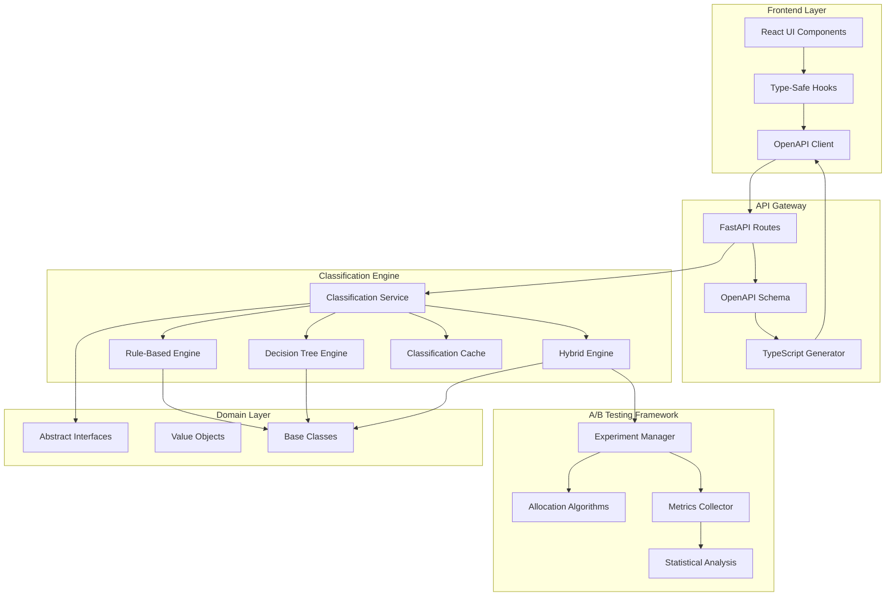

# Comprehensive Classification System Architecture

## Executive Summary

This document outlines the sophisticated classification system architecture for Sparrow's workflow automation platform. The system builds upon the SOLID foundation established by backend-guardian, implementing advanced decision engines, A/B testing capabilities, and seamless frontend integration through TypeScript type generation.

## Architecture Overview



## Core Components

### 1. Classification Engines

#### Rule-Based Engine
- **Purpose**: Fast, explainable classification using predefined rules
- **Strengths**: 
  - Deterministic results
  - Easy to debug and explain
  - Sub-millisecond response times
- **Use Cases**: 
  - Emergency classifications
  - High-confidence keyword matches
  - Compliance-required decisions

#### Decision Tree Engine
- **Purpose**: Sophisticated hierarchical decision making
- **Strengths**:
  - Visual representation possible
  - Handles complex conditions
  - Good balance of speed and accuracy
- **Use Cases**:
  - Multi-factor classifications
  - User intent disambiguation
  - Goal type determination

#### Hybrid Engine
- **Purpose**: Ensemble approach combining multiple strategies
- **Strengths**:
  - Higher accuracy through voting
  - Supports A/B testing
  - Adaptive learning capability
- **Use Cases**:
  - Production deployments
  - Experimentation
  - Personalized experiences

### 2. A/B Testing Framework

#### Experiment Types
```python
class ExperimentType(Enum):
    AB_TEST = "ab_test"              # Traditional split testing
    MULTI_ARMED_BANDIT = "mab"       # Adaptive allocation
    CONTEXTUAL_BANDIT = "contextual" # Personalized allocation
    FEATURE_FLAG = "feature_flag"    # Simple on/off toggles
```

#### Allocation Strategies

**Fixed Allocation**
- Consistent user assignment using MD5 hashing
- Guarantees same variant for returning users
- Perfect for traditional A/B tests

**Thompson Sampling**
- Multi-armed bandit approach
- Automatically favors better-performing variants
- Balances exploration vs exploitation

**Contextual Bandit**
- Considers user context (demographics, behavior)
- Personalized variant selection
- Machine learning ready

#### Statistical Analysis
- Confidence intervals using Wilson score
- Chi-square tests for significance
- Automatic sample size calculations
- Real-time p-value computation

### 3. TypeScript Integration

#### OpenAPI Schema Generation
```python
# Automatic schema generation from FastAPI
generator = OpenAPIGenerator(app)
schema = generator.generate_schema()

# Enhanced with TypeScript metadata
schema["components"]["schemas"]["WorkflowCategory"]["x-enum-varnames"] = [
    "Optimize", "Protect", "Grow", "Emergency", "Automate", "Analyze"
]
```

#### Type Generation Pipeline
```bash
# Generate TypeScript types
npx openapi-typescript openapi.yaml -o api-types.d.ts

# Result: Fully typed API client
import type { paths, components } from './api-types';
type Classification = components['schemas']['WorkflowClassification'];
```

#### React Hooks Integration
```typescript
// Auto-generated type-safe hooks
export function useClassification(input: string, context?: any) {
  return useQuery({
    queryKey: ['classification', input, context],
    queryFn: () => classificationApi.classify(input, context),
    staleTime: 5 * 60 * 1000, // 5 minutes
  });
}
```

## Data Flow Architecture

### Classification Request Flow

1. **Frontend Initiation**
   ```typescript
   const { data, isLoading } = useClassification(userInput, userContext);
   ```

2. **API Gateway Processing**
   - Request validation via Pydantic
   - Authentication/authorization
   - Rate limiting

3. **Classification Service**
   - Cache lookup
   - Engine selection based on configuration
   - A/B test variant assignment (if applicable)

4. **Engine Execution**
   - Parallel execution for hybrid approach
   - Confidence scoring
   - Suggestion generation

5. **Response Construction**
   - Result caching
   - Metrics recording
   - TypeScript-typed response

### A/B Test Flow

1. **Experiment Configuration**
   ```python
   experiment = Experiment(
       id="classification_v2",
       type=ExperimentType.AB_TEST,
       variants=[control, treatment],
       metrics=ExperimentMetrics(
           primary_metric="classification_accuracy",
           minimum_sample_size=1000
       )
   )
   ```

2. **User Assignment**
   - Check target segment eligibility
   - Look up existing assignment (sticky)
   - Allocate if new user
   - Record exposure event

3. **Variant Application**
   - Apply variant configuration
   - Execute with variant-specific engine
   - Track performance metrics

4. **Analysis & Reporting**
   - Real-time statistical analysis
   - Confidence interval calculation
   - Automatic winner detection
   - Recommendation generation

## Performance Optimization

### Caching Strategy

**Multi-Level Cache**
```python
class ClassificationCache:
    def __init__(self, max_size=1000, ttl_seconds=3600):
        self.l1_cache = {}  # In-memory
        self.l2_cache = Redis()  # Distributed
        self.l3_cache = DynamoDB()  # Persistent
```

**Cache Key Generation**
- SHA256 hash of input + context
- Automatic expiration
- LRU eviction policy

### Concurrent Processing

**Async Classification**
```python
async def classify_batch(inputs: List[str]) -> List[Classification]:
    tasks = [self.classify(input) for input in inputs]
    return await asyncio.gather(*tasks)
```

**Engine Parallelization**
- Hybrid engine runs all sub-engines concurrently
- Weighted voting on results
- Fallback to fastest engine on timeout

## Monitoring & Observability

### Metrics Collection

**Classification Metrics**
- Total classifications
- Cache hit rate
- Average latency
- Category distribution
- Confidence score distribution

**A/B Test Metrics**
- Exposures per variant
- Conversion rates
- Statistical significance
- Guardrail metrics

### Logging Strategy

```python
logger.info(
    f"Classification completed",
    extra={
        "user_id": context.user_id,
        "category": result.category.value,
        "confidence": result.confidence,
        "duration_ms": duration * 1000,
        "cache_hit": cached,
        "experiment_id": experiment_id,
        "variant_id": variant_id
    }
)
```

## Security Considerations

### Input Validation
- Pydantic models for all requests
- Input sanitization
- Length limits
- Rate limiting per user

### Data Privacy
- No PII in cache keys
- Encrypted experiment assignments
- Audit trail for all classifications
- GDPR-compliant data retention

## Deployment Architecture

### Container Structure
```dockerfile
FROM python:3.11-slim

# Install dependencies
COPY requirements.txt .
RUN pip install -r requirements.txt

# Copy application
COPY workflows/ /app/workflows/

# Generate TypeScript types on build
RUN python -m workflows.api.openapi_generator

# Start server
CMD ["uvicorn", "workflows.api.main:app"]
```

### Scaling Strategy

**Horizontal Scaling**
- Stateless classification engines
- Shared cache via Redis
- Load balancing via ALB

**Vertical Scaling**
- Async processing for I/O
- Connection pooling
- Memory-mapped cache

## Migration Path

### Phase 1: Foundation (Completed)
- ✅ SOLID architecture implementation
- ✅ Abstract interfaces and base classes
- ✅ Value objects and domain models

### Phase 2: Classification Engines (Current)
- ✅ Rule-based engine
- ✅ Decision tree engine
- ✅ Hybrid ensemble engine
- ✅ Classification caching

### Phase 3: A/B Testing
- ✅ Experiment configuration
- ✅ Allocation algorithms
- ✅ Metrics collection
- ✅ Statistical analysis

### Phase 4: Frontend Integration
- ✅ OpenAPI schema generation
- ✅ TypeScript type generation
- ✅ React hooks creation
- ⏳ Frontend implementation

### Phase 5: ML Enhancement
- ⏳ Feature extraction pipeline
- ⏳ Model training infrastructure
- ⏳ Online learning capability
- ⏳ Personalization models

## Testing Strategy

### Unit Tests
```python
def test_rule_based_classification():
    engine = RuleBasedClassificationEngine()
    result = await engine.classify(
        "I need to save money",
        WorkflowContext(user_id="test")
    )
    assert result.category == WorkflowCategory.OPTIMIZE
    assert result.confidence >= 0.7
```

### Integration Tests
```python
def test_ab_test_allocation():
    manager = ExperimentManager()
    manager.create_experiment(test_experiment)
    
    # Test consistent allocation
    variant1 = manager.get_variant("exp1", context)
    variant2 = manager.get_variant("exp1", context)
    assert variant1.id == variant2.id
```

### Load Tests
```python
async def test_classification_throughput():
    service = ClassificationService()
    
    start = time.time()
    results = await asyncio.gather(*[
        service.classify(f"input_{i}", context)
        for i in range(1000)
    ])
    duration = time.time() - start
    
    assert duration < 5.0  # 1000 requests in 5 seconds
    assert all(r.confidence > 0 for r in results)
```

## Best Practices

### 1. Classification Rules
- Keep rules simple and composable
- Version control all rule changes
- A/B test new rule sets
- Monitor confidence scores

### 2. Experiment Design
- Always include a control group
- Run for statistical significance
- Monitor guardrail metrics
- Document learnings

### 3. Type Safety
- Regenerate types on schema changes
- Use strict TypeScript settings
- Validate at compile time
- Test type definitions

### 4. Performance
- Cache aggressively but safely
- Use async/await throughout
- Profile bottlenecks regularly
- Set SLO targets

## Future Enhancements

### Machine Learning Integration
- TensorFlow.js for client-side inference
- ONNX runtime for model portability
- Feature store for real-time features
- AutoML for continuous improvement

### Advanced Personalization
- User embedding generation
- Collaborative filtering
- Contextual recommendations
- Reinforcement learning

### Real-time Capabilities
- WebSocket for live updates
- Server-sent events for experiments
- GraphQL subscriptions
- Event sourcing

## Conclusion

This classification system architecture provides:

1. **Flexibility**: Multiple engines for different use cases
2. **Experimentation**: Built-in A/B testing framework
3. **Type Safety**: End-to-end TypeScript integration
4. **Performance**: Caching and optimization strategies
5. **Scalability**: Horizontal and vertical scaling paths
6. **Maintainability**: SOLID principles throughout

The architecture is designed to evolve with the product, supporting everything from simple rule-based classification to sophisticated ML-powered personalization, while maintaining code quality and system reliability.

## Architecture Decision Records

### ADR-001: Hybrid Classification Approach
**Status**: Accepted  
**Context**: Need to balance accuracy, explainability, and performance  
**Decision**: Implement multiple engines with ensemble voting  
**Consequences**: Higher complexity but better flexibility  

### ADR-002: TypeScript Generation
**Status**: Accepted  
**Context**: Frontend needs type-safe API integration  
**Decision**: Generate types from OpenAPI schema  
**Consequences**: Single source of truth for API contract  

### ADR-003: A/B Testing Framework
**Status**: Accepted  
**Context**: Need to validate classification improvements  
**Decision**: Built-in experimentation platform  
**Consequences**: Data-driven decision making capability  

### ADR-004: Caching Strategy
**Status**: Accepted  
**Context**: Classification can be expensive  
**Decision**: Multi-level cache with TTL  
**Consequences**: Improved performance, eventual consistency