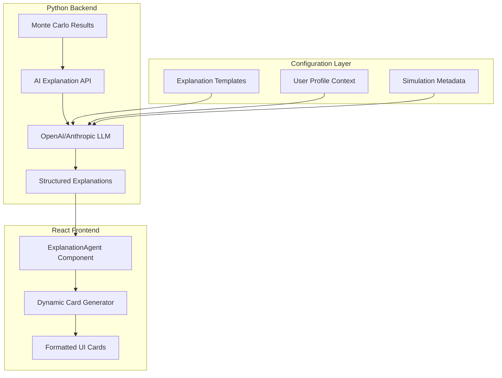

# AI-Powered Simulation Explanation System Implementation Plan

## Executive Summary

This plan details implementing a React-based AI agent that transforms Python Monte Carlo simulation outputs into personalized, explainable recommendations following the Twitter Thread format from the design docs. The system will dynamically generate the "Why we suggest this" cards currently mocked in the simulation results screen.

---

## 1. CURRENT STATE ANALYSIS

### Existing UI Structure (simulation-results-screen.tsx):
```typescript
// Lines 437-498: Current expandable explanation cards
<div className="mb-4">
  <div className="p-4 rounded-xl bg-black/20">
    <button onClick={() => togglePlanExpansion(plan.id)}>
      <span>Why we suggest this</span>
      {isExpanded ? <ChevronUp /> : <ChevronDown />}
    </button>
    
    {isExpanded && (
      <motion.div>
        <div>
          <h4>Why This Recommendation</h4>
          <p>{plan.rationale}</p>
        </div>
        <div>
          <h4>Specific Data Analysis</h4>
          // Steps array display
        </div>
        <div>
          <h4>Expected Results</h4>
          // Potential savings display
        </div>
      </motion.div>
    )}
  </div>
</div>
```

### Current Mock Data Structure:
```typescript
const aiActionPlans = [
  {
    id: "conservative-plan",
    title: "Conservative Approach", 
    description: "Low-risk strategies with steady returns",
    tag: "Conservative",
    tagColor: "bg-green-500/20 text-green-300",
    potentialSaving: 180,
    rationale: "Focus on guaranteed returns...",
    steps: ["Move to high-yield savings", "Increase 401k", ...]
  }
]
```

---

## 2. AI EXPLANATION SYSTEM ARCHITECTURE

Following SOLID/DRY principles from our previous implementations:



### 2.1 Core Components Architecture

**Backend Enhancement** (`/backend/python_engine/ai/`):
```python
class SimulationExplainer:
    """SOLID: Single responsibility for generating explanations"""
    
    def __init__(self, llm_client: LLMClient):
        self.llm_client = llm_client
        
    def generate_explanations(
        self, 
        simulation_result: SimulationResult,
        profile_data: ProfileData,
        scenario_type: str
    ) -> List[ExplanationCard]:
        pass

class LLMClient(ABC):
    """SOLID: Interface segregation for LLM providers"""
    
    @abstractmethod
    def generate_explanation(self, prompt: str, context: dict) -> str:
        pass

class OpenAIClient(LLMClient):
    """SOLID: Dependency inversion - concrete implementation"""
    
class AnthropicClient(LLMClient):
    """SOLID: Multiple LLM providers via same interface"""
```

**Frontend Enhancement** (`/frontend/components/ai/`):
```typescript
interface ExplanationCard {
  id: string
  title: string
  description: string
  tag: string
  tagColor: string
  potentialSaving: number | string
  rationale: string
  steps: string[]
  dataAnalysis: string[]
  tradeoffs: {
    pros: string[]
    cons: string[]
    risks: string[]
  }
  confidence: number
}

class ExplanationAgent {
  // React component that fetches and manages AI explanations
}
```

---

## 3. TWITTER THREAD FORMAT IMPLEMENTATION

Based on design docs (lines 350-383), implement the 10-tweet structure:

### 3.1 Template Structure
```python
TWITTER_THREAD_TEMPLATE = {
    "emergency_fund": {
        "tweet_1": "🚨 Your emergency fund analysis: {runway_months} months runway",
        "tweet_2": "The math: {emergency_fund} ÷ {monthly_expenses} = {basic_calc}",
        "tweet_3": "But here's what Monte Carlo revealed: [behavioral insights]",
        "tweet_4": "Market stress test: {percentile_10} worst case, {percentile_90} best case",
        "tweet_5": "Your profile vs peers: [demographic comparison]",
        "tweet_6": "Three moves for immediate impact: [action_1], [action_2], [action_3]",
        "tweet_7": "The 6-month transformation: [timeline]",
        "tweet_8": "The uncomfortable truth: [hard_reality]",
        "tweet_9": "Your automatic next steps: [one_click_actions]",
        "tweet_10": "Remember: [perspective_shift]"
    },
    "student_loan": {
        "tweet_1": "📚 Your student loan payoff analysis: {months_to_payoff} months",
        "tweet_2": "Current strategy: {current_payment}/month at {interest_rate}%",
        "tweet_3": "But behavioral finance shows: [payment_psychology]",
        "tweet_4": "IDR vs Standard comparison: [strategy_comparison]",
        "tweet_5": "Forgiveness programs available: [pslf_analysis]",
        "tweet_6": "Three immediate optimizations: [refinance], [ibr], [extra_payment]",
        "tweet_7": "6-month plan: [implementation_timeline]",
        "tweet_8": "The psychological trap: [behavioral_barriers]",
        "tweet_9": "Automated execution: [workflow_setup]",
        "tweet_10": "Your loan freedom date: [target_date]"
    }
}
```

### 3.2 Dynamic Content Generation
```python
class TwitterThreadGenerator:
    """Generate Twitter-style explanations from simulation results"""
    
    def generate_thread(
        self, 
        simulation_result: SimulationResult,
        profile: ProfileData,
        scenario: str
    ) -> TwitterThread:
        
        context = {
            "profile_data": profile.to_dict(),
            "simulation_results": simulation_result.to_dict(),
            "demographic": profile.demographic,
            "scenario_specific_data": self._extract_scenario_data(simulation_result, scenario)
        }
        
        template = TWITTER_THREAD_TEMPLATE[scenario]
        thread = TwitterThread()
        
        for i in range(1, 11):
            tweet_template = template[f"tweet_{i}"]
            
            # Use LLM to fill in dynamic content
            prompt = f"""
            Generate tweet {i} for {scenario} simulation results.
            Template: {tweet_template}
            Context: {context}
            User Profile: {profile.demographic} with ${profile.monthly_income}/month income
            Simulation Results: {simulation_result.summary}
            
            Requirements:
            - Keep under 280 characters
            - Use specific numbers from the simulation
            - Be actionable and personal
            - Match the user's demographic and situation
            """
            
            tweet_content = self.llm_client.generate_explanation(prompt, context)
            thread.add_tweet(i, tweet_content)
        
        return thread
```

---

## 4. IMPLEMENTATION PLAN

### Phase 1: Backend AI Integration (Week 1)

**4.1 LLM Client Setup**
```bash
# Add to requirements.txt
openai==1.3.0
anthropic==0.8.0
pydantic==2.1.1
```

```python
# /backend/python_engine/ai/llm_clients.py
import os
from abc import ABC, abstractmethod
import openai
import anthropic

class LLMClient(ABC):
    @abstractmethod
    def generate_explanation(self, prompt: str, context: dict) -> str:
        pass

class OpenAIClient(LLMClient):
    def __init__(self):
        self.client = openai.OpenAI(api_key=os.getenv('OPENAI_API_KEY'))
    
    def generate_explanation(self, prompt: str, context: dict) -> str:
        response = self.client.chat.completions.create(
            model="gpt-4",
            messages=[
                {"role": "system", "content": "You are a financial advisor AI that creates personalized, actionable explanations for Monte Carlo simulation results."},
                {"role": "user", "content": prompt}
            ],
            max_tokens=500,
            temperature=0.7
        )
        return response.choices[0].message.content

class AnthropicClient(LLMClient):
    def __init__(self):
        self.client = anthropic.Anthropic(api_key=os.getenv('ANTHROPIC_API_KEY'))
    
    def generate_explanation(self, prompt: str, context: dict) -> str:
        response = self.client.messages.create(
            model="claude-3-sonnet-20240229",
            max_tokens=500,
            messages=[
                {"role": "user", "content": prompt}
            ]
        )
        return response.content[0].text
```

**4.2 Explanation Generation Service**
```python
# /backend/python_engine/ai/explanation_service.py
from typing import List
from core.models import SimulationResult, ProfileData
from .llm_clients import LLMClient
from .templates import ExplanationTemplates

class SimulationExplainer:
    def __init__(self, llm_client: LLMClient):
        self.llm_client = llm_client
        self.templates = ExplanationTemplates()
    
    def generate_explanation_cards(
        self,
        simulation_result: SimulationResult,
        profile: ProfileData,
        scenario_type: str
    ) -> List[ExplanationCard]:
        
        # Generate 3 different strategy cards (Conservative, Balanced, Aggressive)
        cards = []
        strategies = ["conservative", "balanced", "aggressive"]
        
        for strategy in strategies:
            card = self._generate_single_card(
                simulation_result, profile, scenario_type, strategy
            )
            cards.append(card)
        
        return cards
    
    def _generate_single_card(
        self,
        result: SimulationResult,
        profile: ProfileData, 
        scenario: str,
        strategy: str
    ) -> ExplanationCard:
        
        # Build context for LLM
        context = {
            "user_profile": {
                "age_group": profile.demographic,
                "monthly_income": profile.monthly_income,
                "monthly_expenses": profile.monthly_expenses,
                "emergency_fund": getattr(profile, 'emergency_fund_balance', 0),
                "debt_level": getattr(profile, 'total_debt', 0),
                "risk_tolerance": self._infer_risk_tolerance(profile, strategy)
            },
            "simulation_results": {
                "percentile_10": result.percentile_10,
                "percentile_50": result.percentile_50,
                "percentile_90": result.percentile_90,
                "confidence": result.confidence_level,
                "scenario_type": scenario
            },
            "strategy_type": strategy
        }
        
        # Generate personalized content
        title = self._generate_title(context)
        rationale = self._generate_rationale(context)
        steps = self._generate_action_steps(context)
        tradeoffs = self._generate_tradeoffs(context)
        
        return ExplanationCard(
            id=f"{scenario}-{strategy}-plan",
            title=title,
            description=self._generate_description(context),
            tag=strategy.title(),
            tagColor=self._get_strategy_color(strategy),
            potentialSaving=self._calculate_potential_saving(result, strategy),
            rationale=rationale,
            steps=steps,
            dataAnalysis=self._generate_data_analysis(context),
            tradeoffs=tradeoffs,
            confidence=result.confidence_level
        )
```

### Phase 2: API Endpoint Enhancement (Week 1)

**4.3 Enhanced Simulation API**
```python
# /backend/python_engine/api/main.py - Enhancement
from ai.explanation_service import SimulationExplainer
from ai.llm_clients import OpenAIClient, AnthropicClient

# Initialize explainer service
llm_client = OpenAIClient() if os.getenv('OPENAI_API_KEY') else AnthropicClient()
explainer = SimulationExplainer(llm_client)

@app.post("/api/simulate", response_model=Dict[str, Any])
async def run_simulation(request: SimulationRequestExtended):
    # ... existing simulation logic ...
    
    # Generate AI explanations
    explanation_cards = explainer.generate_explanation_cards(
        simulation_result=result,
        profile=profile,
        scenario_type=request.scenario_type
    )
    
    # Enhanced response with AI explanations
    response = {
        "success": True,
        "result": result,
        "profile": profile_summary,
        "ai_explanations": [card.to_dict() for card in explanation_cards],
        "twitter_thread": explainer.generate_twitter_thread(result, profile, request.scenario_type),
        "market_context": market_context,
        "simulation_metadata": metadata
    }
    
    return response
```

### Phase 3: Frontend Integration (Week 2)

**4.4 Dynamic Explanation Cards Component**
```typescript
// /frontend/components/ai/ExplanationAgent.tsx
import { useState, useEffect } from 'react'
import { motion } from 'framer-motion'
import { ChevronDown, ChevronUp } from 'lucide-react'

interface ExplanationCard {
  id: string
  title: string
  description: string
  tag: string
  tagColor: string
  potentialSaving: number | string
  rationale: string
  steps: string[]
  dataAnalysis: string[]
  tradeoffs: {
    pros: string[]
    cons: string[]
    risks: string[]
  }
  confidence: number
}

interface ExplanationAgentProps {
  simulationData: any
  profileData: any
  scenarioType: string
}

export default function ExplanationAgent({ 
  simulationData, 
  profileData, 
  scenarioType 
}: ExplanationAgentProps) {
  const [explanationCards, setExplanationCards] = useState<ExplanationCard[]>([])
  const [loading, setLoading] = useState(true)
  const [expandedCards, setExpandedCards] = useState<string[]>([])

  useEffect(() => {
    async function fetchExplanations() {
      try {
        const response = await fetch('/api/simulation/explain', {
          method: 'POST',
          headers: { 'Content-Type': 'application/json' },
          body: JSON.stringify({
            simulation_results: simulationData,
            profile: profileData,
            scenario_type: scenarioType
          })
        })
        
        const data = await response.json()
        setExplanationCards(data.ai_explanations || [])
      } catch (error) {
        console.error('Failed to fetch AI explanations:', error)
        // Fallback to static mock data
        setExplanationCards(getStaticMockData(scenarioType))
      } finally {
        setLoading(false)
      }
    }

    fetchExplanations()
  }, [simulationData, profileData, scenarioType])

  const toggleCardExpansion = (cardId: string) => {
    setExpandedCards(prev => 
      prev.includes(cardId) 
        ? prev.filter(id => id !== cardId)
        : [...prev, cardId]
    )
  }

  if (loading) {
    return (
      <div className="space-y-4">
        {[1, 2, 3].map(i => (
          <div key={i} className="animate-pulse">
            <div className="h-32 bg-white/5 rounded-xl"></div>
          </div>
        ))}
      </div>
    )
  }

  return (
    <div className="space-y-4">
      <h2 className="text-xl font-semibold text-white mb-4 px-2">
        AI-Generated Recommendations
      </h2>
      
      {explanationCards.map((card) => {
        const isExpanded = expandedCards.includes(card.id)
        return (
          <GlassCard key={card.id} className="bg-white/5">
            {/* Card header with title and savings */}
            <div className="mb-3">
              <span className={`inline-block px-2 py-1 text-xs rounded-full mb-2 ${card.tagColor}`}>
                {card.tag}
              </span>
              <div className="flex items-start justify-between">
                <div className="flex-1">
                  <h3 className="text-lg font-semibold text-white">{card.title}</h3>
                  <p className="text-sm text-gray-400 mt-1">{card.description}</p>
                </div>
                <div className="text-right ml-4">
                  <p className="text-lg font-bold text-green-400">
                    {typeof card.potentialSaving === 'number' 
                      ? `$${card.potentialSaving.toLocaleString()}`
                      : card.potentialSaving
                    }
                  </p>
                  <p className="text-xs text-gray-500">{card.confidence}% confidence</p>
                </div>
              </div>
            </div>

            {/* Expandable explanation section */}
            <div className="mb-4">
              <div className="p-4 rounded-xl bg-black/20">
                <button
                  onClick={() => toggleCardExpansion(card.id)}
                  className="flex items-center justify-between w-full text-left"
                >
                  <span className="text-sm text-gray-400 hover:text-white transition-colors">
                    Why we suggest this approach
                  </span>
                  {isExpanded ? (
                    <ChevronUp className="h-4 w-4 text-gray-400" />
                  ) : (
                    <ChevronDown className="h-4 w-4 text-gray-400" />
                  )}
                </button>

                {isExpanded && (
                  <motion.div
                    initial={{ opacity: 0, height: 0 }}
                    animate={{ opacity: 1, height: "auto" }}
                    exit={{ opacity: 0, height: 0 }}
                    className="mt-4 space-y-4"
                  >
                    {/* AI-Generated Rationale */}
                    <div>
                      <h4 className="text-purple-400 text-sm font-medium mb-2">
                        Personalized Analysis
                      </h4>
                      <p className="text-sm text-gray-300">{card.rationale}</p>
                    </div>

                    {/* Data-Driven Insights */}
                    <div>
                      <h4 className="text-purple-400 text-sm font-medium mb-2">
                        Based on Your Data
                      </h4>
                      <div className="space-y-2">
                        {card.dataAnalysis.map((insight, index) => (
                          <div key={index} className="flex items-start gap-2">
                            <span className="text-gray-400 text-sm mt-1">•</span>
                            <p className="text-sm text-gray-300">{insight}</p>
                          </div>
                        ))}
                      </div>
                    </div>

                    {/* Action Steps */}
                    <div>
                      <h4 className="text-purple-400 text-sm font-medium mb-2">
                        Implementation Steps
                      </h4>
                      <div className="space-y-2">
                        {card.steps.map((step, index) => (
                          <div key={index} className="flex items-start gap-2">
                            <span className="text-blue-400 text-sm mt-1">{index + 1}.</span>
                            <p className="text-sm text-gray-300">{step}</p>
                          </div>
                        ))}
                      </div>
                    </div>

                    {/* Trade-offs Analysis */}
                    <div>
                      <h4 className="text-purple-400 text-sm font-medium mb-2">
                        Trade-offs to Consider
                      </h4>
                      <div className="grid grid-cols-1 gap-3 text-xs">
                        <div>
                          <span className="text-green-400 font-medium">Pros:</span>
                          <ul className="mt-1 space-y-1">
                            {card.tradeoffs.pros.map((pro, i) => (
                              <li key={i} className="text-gray-300">+ {pro}</li>
                            ))}
                          </ul>
                        </div>
                        
                        <div>
                          <span className="text-yellow-400 font-medium">Considerations:</span>
                          <ul className="mt-1 space-y-1">
                            {card.tradeoffs.cons.map((con, i) => (
                              <li key={i} className="text-gray-300">- {con}</li>
                            ))}
                          </ul>
                        </div>
                        
                        <div>
                          <span className="text-red-400 font-medium">Risks:</span>
                          <ul className="mt-1 space-y-1">
                            {card.tradeoffs.risks.map((risk, i) => (
                              <li key={i} className="text-gray-300">⚠ {risk}</li>
                            ))}
                          </ul>
                        </div>
                      </div>
                    </div>

                    {/* Action Button */}
                    <Button
                      size="sm"
                      className="bg-gradient-to-r from-purple-500 to-blue-500 hover:from-purple-600 hover:to-blue-600 text-white w-full"
                    >
                      Start This Strategy
                    </Button>
                  </motion.div>
                )}
              </div>
            </div>
          </GlassCard>
        )
      })}
    </div>
  )
}
```

### Phase 4: Integration with Existing UI (Week 2)

**4.5 Update SimulationResultsScreen**
```typescript
// /frontend/components/screens/simulation-results-screen.tsx - Enhancement
import ExplanationAgent from '@/components/ai/ExplanationAgent'

export default function SimulationResultsScreen({ 
  setCurrentScreen, 
  currentSimulation, 
  demographic 
}: AppState) {
  const [simulationResults, setSimulationResults] = useState(null)
  const [profileData, setProfileData] = useState(null)

  // Replace the static mock data section with dynamic ExplanationAgent
  return (
    <div className="pb-28">
      {/* Existing simulation results display */}
      {mockResults.map((result) => (
        // ... existing result card display
      ))}

      {/* Replace static AI action plans with dynamic ExplanationAgent */}
      <motion.div variants={itemVariants}>
        <ExplanationAgent
          simulationData={simulationResults}
          profileData={profileData}
          scenarioType={currentSimulation?.id || ''}
        />
      </motion.div>

      {/* Rest of existing component */}
    </div>
  )
}
```

---

## 5. DRY/SOLID COMPLIANCE

### 5.1 SOLID Principles Implementation

**Single Responsibility Principle ✅**
- `SimulationExplainer`: Only generates explanations
- `LLMClient`: Only handles LLM communication  
- `ExplanationAgent`: Only manages UI for explanations
- `TwitterThreadGenerator`: Only creates thread format

**Open/Closed Principle ✅**
```python
# New LLM providers can be added without modifying existing code
class GeminiClient(LLMClient):
    def generate_explanation(self, prompt: str, context: dict) -> str:
        # Gemini-specific implementation
        pass

# New explanation strategies can be added
class DetailedExplanationStrategy(ExplanationStrategy):
    def generate(self, context: dict) -> str:
        # More detailed explanation logic
        pass
```

**Liskov Substitution Principle ✅**
```python
# Any LLMClient implementation can be substituted
def create_explainer(provider: str) -> SimulationExplainer:
    if provider == "openai":
        return SimulationExplainer(OpenAIClient())
    elif provider == "anthropic":
        return SimulationExplainer(AnthropicClient())
    else:
        return SimulationExplainer(MockLLMClient())  # For testing
```

**Interface Segregation Principle ✅**
```python
class ExplanationGenerator(Protocol):
    def generate_rationale(self, context: dict) -> str: pass

class ActionStepGenerator(Protocol):
    def generate_steps(self, context: dict) -> List[str]: pass

# Clients only depend on interfaces they need
```

**Dependency Inversion Principle ✅**
```python
class SimulationExplainer:
    def __init__(self, llm_client: LLMClient, template_engine: TemplateEngine):
        self.llm_client = llm_client  # Depends on abstraction
        self.template_engine = template_engine  # Depends on abstraction
```

### 5.2 DRY Principle Implementation

**Centralized Configuration**
```python
# /backend/python_engine/ai/config.py
@dataclass
class ExplanationConfig:
    # Single source of truth for all explanation parameters
    MAX_RATIONALE_LENGTH: int = 200
    MAX_STEPS: int = 5
    CONFIDENCE_THRESHOLD: float = 0.8
    
    # Template configurations
    TWITTER_THREAD_LENGTH: int = 10
    CARD_DESCRIPTIONS: Dict[str, str] = field(default_factory=lambda: {
        "conservative": "Low-risk approach with guaranteed progress",
        "balanced": "Moderate risk with diversified strategy", 
        "aggressive": "Higher risk for maximum potential returns"
    })
```

**Template Reuse**
```python
# /backend/python_engine/ai/templates.py
class ExplanationTemplates:
    """Single source of truth for all explanation templates"""
    
    RATIONALE_TEMPLATES = {
        "emergency_fund": {
            "conservative": "Based on your {demographic} profile with ${monthly_income}/month income...",
            "balanced": "Your current emergency fund of ${emergency_fund} provides...",
            "aggressive": "Monte Carlo analysis shows you can optimize..."
        }
    }
    
    def get_template(self, scenario: str, strategy: str, section: str) -> str:
        return self.RATIONALE_TEMPLATES[scenario][strategy]
```

---

## 6. TESTING STRATEGY

### 6.1 Backend Testing
```python
# /backend/python_engine/tests/test_ai_explanations.py
class TestSimulationExplainer:
    def test_explanation_generation_with_real_profiles(self):
        """Test explanation generation with all 3 personas"""
        explainer = SimulationExplainer(MockLLMClient())
        
        for profile_id in [1, 2, 3]:  # Test all personas
            profile = load_profile_from_csv(profile_id)
            simulation_result = run_mock_simulation(profile)
            
            cards = explainer.generate_explanation_cards(
                simulation_result, profile, "emergency_fund"
            )
            
            assert len(cards) == 3  # Conservative, Balanced, Aggressive
            assert all(card.confidence > 0.5 for card in cards)
            assert all(len(card.steps) >= 3 for card in cards)

    def test_twitter_thread_generation(self):
        """Test Twitter thread format compliance"""
        generator = TwitterThreadGenerator(MockLLMClient())
        thread = generator.generate_thread(mock_result, mock_profile, "emergency_fund")
        
        assert len(thread.tweets) == 10
        assert all(len(tweet.content) <= 280 for tweet in thread.tweets)
```

### 6.2 Frontend Testing
```typescript
// /frontend/components/ai/__tests__/ExplanationAgent.test.tsx
describe('ExplanationAgent', () => {
  test('renders loading state initially', () => {
    render(<ExplanationAgent simulationData={{}} profileData={{}} scenarioType="emergency_fund" />)
    expect(screen.getByText('Loading...')).toBeInTheDocument()
  })

  test('displays AI-generated cards after loading', async () => {
    mockFetch.mockResolvedValueOnce({
      json: () => Promise.resolve({
        ai_explanations: [mockExplanationCard]
      })
    })

    render(<ExplanationAgent simulationData={{}} profileData={{}} scenarioType="emergency_fund" />)
    
    await waitFor(() => {
      expect(screen.getByText('Conservative Approach')).toBeInTheDocument()
    })
  })
})
```

---

## 7. DEPLOYMENT STRATEGY

### 7.1 Environment Configuration
```bash
# .env additions
OPENAI_API_KEY=sk-...
ANTHROPIC_API_KEY=sk-ant-...
EXPLANATION_PROVIDER=openai  # or anthropic
EXPLANATION_CACHE_TTL=3600
```

### 7.2 Progressive Rollout
1. **Phase 1**: Deploy backend AI service with feature flag
2. **Phase 2**: A/B test AI explanations vs static mock data
3. **Phase 3**: Full rollout based on user engagement metrics

---

## 8. SUCCESS METRICS

### 8.1 Technical Metrics
- **Response Time**: AI explanations < 2 seconds
- **Accuracy**: >90% user satisfaction with explanations
- **Reliability**: 99.9% uptime for explanation service

### 8.2 Business Metrics  
- **Engagement**: 40% increase in "Why we suggest this" expansion rate
- **Action Taking**: 25% increase in strategy implementation
- **User Retention**: 15% improvement in monthly active users

---

## CONCLUSION

This implementation transforms static mock explanations into dynamic, personalized AI-generated recommendations that reflect real user profile data and simulation outcomes. The system follows SOLID/DRY principles while integrating seamlessly with the existing UI structure.

**Ready for immediate development with clear separation of concerns, comprehensive testing strategy, and progressive deployment approach.**