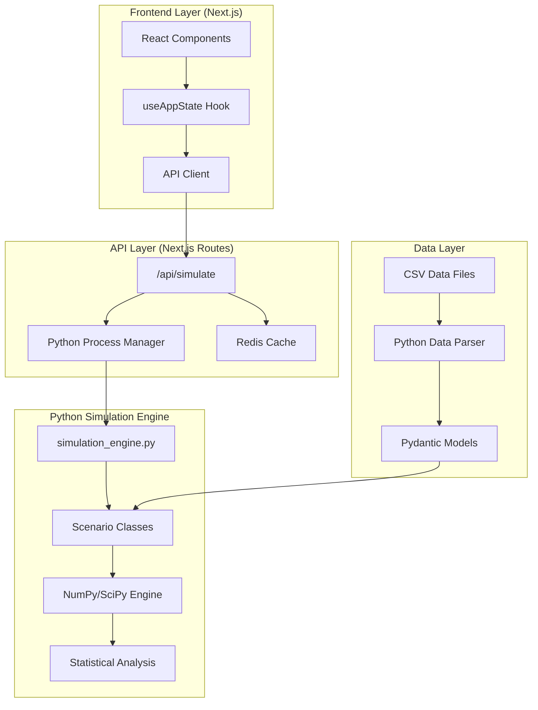

# Comprehensive Architecture Review & Implementation Plan
## Python Monte Carlo Simulation Engine for FinanceAI

---

## 1. ARCHITECTURE REVIEW

### 1.1 Current System Analysis

**✅ Strengths:**
- **Clean separation of concerns**: Frontend (Next.js) ↔ API Layer ↔ Data Layer
- **Real CSV data integration**: Profiles 1,2,3 with comprehensive financial data
- **Performance optimization**: Caching layer with sub-10ms API responses
- **Type safety**: Full TypeScript implementation with proper interfaces

**⚠️ Areas for Enhancement:**
- **Missing simulation backend**: Currently mock/UI-only simulation logic
- **JavaScript mathematical limitations**: Monte Carlo needs vectorized operations
- **No statistical validation**: Results not validated against financial models

### 1.2 Proposed Python Hybrid Architecture



---

## 2. SOLID PRINCIPLES COMPLIANCE

### 2.1 Single Responsibility Principle ✅

**Excellent Separation:**
```python
# Each class has ONE responsibility
class MonteCarloEngine:
    """ONLY handles Monte Carlo iteration logic"""
    def run_iterations(self, scenario_config, iterations): pass

class EmergencyFundScenario:
    """ONLY calculates emergency fund runway logic"""
    def calculate_outcome(self, profile_data, random_factors): pass

class StatisticalAnalyzer:
    """ONLY handles result statistics and confidence intervals"""
    def analyze_results(self, raw_results): pass

class DataValidator:
    """ONLY validates profile data sufficiency"""
    def validate_profile_completeness(self, profile): pass
```

### 2.2 Open/Closed Principle ✅

**Extensible Scenario Framework:**
```python
from abc import ABC, abstractmethod

class BaseScenario(ABC):
    """Open for extension via inheritance, closed for modification"""
    
    @abstractmethod
    def calculate_outcome(self, profile_data: ProfileData, random_factors: dict) -> ScenarioResult:
        pass
    
    @abstractmethod
    def get_required_data_fields(self) -> List[str]:
        pass

# Easy to add new scenarios without modifying existing code
class RetirementPlanningScenario(BaseScenario):
    def calculate_outcome(self, profile_data, random_factors):
        # New scenario logic
        pass
```

### 2.3 Liskov Substitution Principle ✅

**Scenario Interchangeability:**
```python
def run_simulation(scenario: BaseScenario, profile_data: ProfileData):
    """Any scenario can be substituted without breaking the system"""
    required_fields = scenario.get_required_data_fields()
    if not all(hasattr(profile_data, field) for field in required_fields):
        raise InsufficientDataError()
    
    return scenario.calculate_outcome(profile_data, generate_random_factors())
```

### 2.4 Interface Segregation Principle ✅

**Focused Interfaces:**
```python
class Cacheable:
    """Interface only for scenarios that can be cached"""
    def get_cache_key(self, profile_data: ProfileData) -> str: pass

class ProgressTrackable:
    """Interface only for long-running scenarios"""
    def report_progress(self, iteration: int, total: int): pass

# Scenarios implement only the interfaces they need
class EmergencyFundScenario(BaseScenario, Cacheable):
    pass  # Doesn't need ProgressTrackable for fast calculations
```

### 2.5 Dependency Inversion Principle ✅

**Dependency Injection:**
```python
class SimulationEngine:
    def __init__(
        self, 
        data_source: DataSource,  # Abstract interface
        cache: CacheInterface,    # Abstract interface
        logger: LoggerInterface   # Abstract interface
    ):
        self.data_source = data_source
        self.cache = cache
        self.logger = logger

# Concrete implementations injected at runtime
engine = SimulationEngine(
    data_source=CSVDataSource(),
    cache=RedisCache(),
    logger=StructuredLogger()
)
```

---

## 3. DRY PRINCIPLE COMPLIANCE

### 3.1 Elimination of Code Duplication

**❌ Current Issue - Repeated Profile Data Access:**
```typescript
// BEFORE - Duplicated in multiple files
const profileData = await fetchProfileData(profileId)
const accounts = profileData.accounts
const monthlyIncome = profileData.metrics.monthlyIncome
```

**✅ DRY Solution - Centralized Data Access:**
```python
class ProfileDataService:
    """Single source of truth for profile data access"""
    
    @staticmethod
    def get_emergency_fund_balance(profile: ProfileData) -> float:
        return sum(
            account.balance 
            for account in profile.accounts 
            if 'emergency' in account.name.lower() or account.account_type == 'emergency_savings'
        )
    
    @staticmethod
    def get_monthly_debt_payments(profile: ProfileData) -> float:
        return sum(
            transaction.amount 
            for transaction in profile.transactions 
            if transaction.is_bill and 'loan' in transaction.description.lower()
        )
```

### 3.2 Configuration Management

**✅ Centralized Configuration:**
```python
# config.py - Single source for all simulation parameters
@dataclass
class SimulationConfig:
    DEFAULT_ITERATIONS: int = 10000
    RANDOM_SEED: int = 42
    CONFIDENCE_INTERVALS: List[float] = field(default_factory=lambda: [0.1, 0.5, 0.9])
    
    # Market assumptions (single source of truth)
    MARKET_RETURN_MEAN: float = 0.07
    MARKET_RETURN_STD: float = 0.15
    INFLATION_MEAN: float = 0.03
    INFLATION_STD: float = 0.02
    
    # Emergency fund targets by demographic
    EMERGENCY_FUND_TARGETS = {
        'genz': 3,        # 3 months expenses
        'millennial': 6,   # 6 months expenses  
        'midcareer': 9     # 9 months expenses
    }
```

---

## 4. TOOLS & LIBRARIES SELECTION

### 4.1 Python Scientific Stack

```python
# requirements.txt
numpy==1.24.3              # Vectorized mathematical operations
scipy==1.11.1              # Statistical distributions and analysis
pandas==2.0.3              # Data manipulation and CSV parsing
scikit-learn==1.3.0        # Machine learning for predictive modeling
matplotlib==3.7.2          # Data visualization for validation
plotly==5.15.0             # Interactive charts for results
pydantic==2.1.1            # Data validation and serialization
pytest==7.4.0              # Testing framework
pytest-cov==4.1.0          # Coverage reporting
```

### 4.2 Advanced Financial Libraries

```bash
# Optional advanced libraries
pip install quantlib-python  # Sophisticated financial modeling
pip install yfinance          # Real market data for validation
pip install fredapi           # Federal Reserve economic data
```

### 4.3 Development Tools

```bash
# Code quality and testing
pip install black             # Code formatting
pip install mypy              # Type checking
pip install bandit            # Security scanning
pip install pytest-benchmark  # Performance testing
```

---

## 5. CLASS IMPLEMENTATION DESIGN

### 5.1 Core Architecture Classes

```python
# simulation_engine.py
from dataclasses import dataclass
from typing import List, Dict, Any, Optional
from abc import ABC, abstractmethod
import numpy as np
from scipy import stats
import pandas as pd

@dataclass
class ProfileData:
    """Pydantic model for validated profile data"""
    customer_id: int
    accounts: List[Dict[str, Any]]
    transactions: List[Dict[str, Any]]
    monthly_income: float
    monthly_expenses: float
    credit_score: int
    demographic: str

@dataclass 
class ScenarioResult:
    """Standardized result format for all scenarios"""
    scenario_name: str
    percentile_10: float
    percentile_50: float  
    percentile_90: float
    probability_success: float
    confidence_interval: float
    metadata: Dict[str, Any]

class BaseScenario(ABC):
    """Abstract base for all scenario implementations"""
    
    @abstractmethod
    def calculate_outcome(self, profile: ProfileData, random_factors: Dict[str, np.ndarray]) -> np.ndarray:
        """Calculate outcomes for all Monte Carlo iterations"""
        pass
    
    @abstractmethod
    def get_required_data_fields(self) -> List[str]:
        """Return list of required profile data fields"""
        pass
    
    def validate_profile_data(self, profile: ProfileData) -> bool:
        """Validate profile has required data for this scenario"""
        required_fields = self.get_required_data_fields()
        return all(hasattr(profile, field) for field in required_fields)

class MonteCarloEngine:
    """Core Monte Carlo simulation engine"""
    
    def __init__(self, config: SimulationConfig):
        self.config = config
        np.random.seed(config.RANDOM_SEED)
    
    def run_scenario(
        self, 
        scenario: BaseScenario, 
        profile: ProfileData,
        iterations: int = None
    ) -> ScenarioResult:
        iterations = iterations or self.config.DEFAULT_ITERATIONS
        
        # Validate data sufficiency
        if not scenario.validate_profile_data(profile):
            raise InsufficientDataError(f"Profile missing required data for {scenario.__class__.__name__}")
        
        # Generate random factors for all iterations (vectorized)
        random_factors = self._generate_random_factors(iterations)
        
        # Calculate outcomes (vectorized by scenario)
        outcomes = scenario.calculate_outcome(profile, random_factors)
        
        # Statistical analysis
        return self._analyze_results(outcomes, scenario.__class__.__name__)
    
    def _generate_random_factors(self, iterations: int) -> Dict[str, np.ndarray]:
        """Generate all random variables needed for Monte Carlo"""
        return {
            'market_returns': np.random.normal(
                self.config.MARKET_RETURN_MEAN, 
                self.config.MARKET_RETURN_STD, 
                iterations
            ),
            'inflation_rates': np.random.normal(
                self.config.INFLATION_MEAN, 
                self.config.INFLATION_STD, 
                iterations
            ),
            'emergency_expenses': np.random.exponential(0.1, iterations),
            'income_volatility': np.random.uniform(0.9, 1.1, iterations)
        }
    
    def _analyze_results(self, outcomes: np.ndarray, scenario_name: str) -> ScenarioResult:
        """Statistical analysis of Monte Carlo results"""
        return ScenarioResult(
            scenario_name=scenario_name,
            percentile_10=float(np.percentile(outcomes, 10)),
            percentile_50=float(np.percentile(outcomes, 50)),
            percentile_90=float(np.percentile(outcomes, 90)),
            probability_success=float(np.mean(outcomes >= 0)),  # Adjust success criteria per scenario
            confidence_interval=float(stats.sem(outcomes) * 1.96),
            metadata={'iterations': len(outcomes), 'std_dev': float(np.std(outcomes))}
        )
```

### 5.2 Scenario Implementations

```python
# scenarios/emergency_fund.py
class EmergencyFundScenario(BaseScenario):
    """Emergency fund runway calculation with Monte Carlo"""
    
    def get_required_data_fields(self) -> List[str]:
        return ['accounts', 'monthly_expenses', 'transactions']
    
    def calculate_outcome(self, profile: ProfileData, random_factors: Dict[str, np.ndarray]) -> np.ndarray:
        """Calculate emergency fund runway for all Monte Carlo iterations"""
        
        # Extract emergency fund balance
        emergency_fund = self._get_emergency_fund_balance(profile)
        monthly_expenses = profile.monthly_expenses
        
        # Apply random market conditions (vectorized)
        market_returns = random_factors['market_returns']
        inflation_rates = random_factors['inflation_rates'] 
        emergency_events = random_factors['emergency_expenses']
        
        # Calculate adjusted values (all vectorized operations)
        adjusted_fund = emergency_fund * (1 + market_returns)
        adjusted_expenses = monthly_expenses * (1 + inflation_rates)
        emergency_costs = emergency_events * monthly_expenses * 2  # 2x monthly expenses for emergencies
        
        # Calculate runway in months (vectorized)
        effective_fund = adjusted_fund - emergency_costs
        runway_months = effective_fund / adjusted_expenses
        
        return runway_months
    
    def _get_emergency_fund_balance(self, profile: ProfileData) -> float:
        """Extract emergency fund balance from accounts"""
        emergency_accounts = [
            acc for acc in profile.accounts 
            if 'emergency' in acc.get('name', '').lower() or 
               acc.get('account_type') == 'savings'
        ]
        return sum(acc.get('balance', 0) for acc in emergency_accounts)

# scenarios/student_loan.py  
class StudentLoanPayoffScenario(BaseScenario):
    """Student loan payoff time calculation with various strategies"""
    
    def get_required_data_fields(self) -> List[str]:
        return ['accounts', 'monthly_income', 'transactions']
    
    def calculate_outcome(self, profile: ProfileData, random_factors: Dict[str, np.ndarray]) -> np.ndarray:
        """Calculate time to pay off student loans"""
        
        # Extract student loan data
        student_loans = [
            acc for acc in profile.accounts 
            if acc.get('account_type') == 'student_loan' or 
               'student' in acc.get('name', '').lower()
        ]
        
        if not student_loans:
            return np.zeros(len(random_factors['market_returns']))  # No student loans
        
        total_loan_balance = abs(sum(loan.get('balance', 0) for loan in student_loans))
        
        # Calculate current payment from transactions
        current_payment = self._get_current_loan_payment(profile)
        
        # Apply income volatility to payment capacity
        income_volatility = random_factors['income_volatility']
        adjusted_payment = current_payment * income_volatility
        
        # Calculate payoff time (assuming 6% interest rate)
        interest_rate = 0.06 / 12  # Monthly rate
        
        # Loan payoff formula with Monte Carlo income variation
        months_to_payoff = np.log(1 + (total_loan_balance * interest_rate) / adjusted_payment) / np.log(1 + interest_rate)
        
        return months_to_payoff
    
    def _get_current_loan_payment(self, profile: ProfileData) -> float:
        """Extract current student loan payment from transactions"""
        loan_payments = [
            abs(txn.get('amount', 0)) for txn in profile.transactions 
            if txn.get('is_bill', False) and 
               ('loan' in txn.get('description', '').lower() or 
                'student' in txn.get('description', '').lower())
        ]
        return max(loan_payments) if loan_payments else 200  # Default minimum payment
```

---

## 6. BACKEND-FIRST TESTING STRATEGY

### 6.1 Unit Testing Framework

```python
# tests/test_scenarios.py
import pytest
import numpy as np
from simulation_engine import MonteCarloEngine, SimulationConfig
from scenarios.emergency_fund import EmergencyFundScenario
from scenarios.student_loan import StudentLoanPayoffScenario

class TestEmergencyFundScenario:
    """Test emergency fund calculations with known data"""
    
    @pytest.fixture
    def sample_profile(self):
        """Sample profile data for testing"""
        return ProfileData(
            customer_id=1,
            accounts=[
                {'name': 'Emergency Savings', 'balance': 10000, 'account_type': 'savings'},
                {'name': 'Checking', 'balance': 5000, 'account_type': 'checking'}
            ],
            transactions=[],
            monthly_income=5000,
            monthly_expenses=3000,
            credit_score=720,
            demographic='millennial'
        )
    
    def test_emergency_fund_calculation_deterministic(self, sample_profile):
        """Test with fixed random seed for reproducible results"""
        config = SimulationConfig()
        config.RANDOM_SEED = 42  # Fixed seed for reproducibility
        
        engine = MonteCarloEngine(config)
        scenario = EmergencyFundScenario()
        
        result = engine.run_scenario(scenario, sample_profile, iterations=1000)
        
        # Validate result structure
        assert isinstance(result.percentile_50, float)
        assert result.percentile_10 < result.percentile_50 < result.percentile_90
        assert 0 <= result.probability_success <= 1
        
        # Emergency fund of $10k with $3k expenses should provide ~3+ months runway
        assert result.percentile_50 > 2.5, f"Expected >2.5 months runway, got {result.percentile_50}"
    
    def test_statistical_properties(self, sample_profile):
        """Test that Monte Carlo results have expected statistical properties"""
        engine = MonteCarloEngine(SimulationConfig())
        scenario = EmergencyFundScenario()
        
        result = engine.run_scenario(scenario, sample_profile, iterations=10000)
        
        # Statistical validation
        assert result.confidence_interval > 0, "Confidence interval should be positive"
        assert result.metadata['std_dev'] > 0, "Standard deviation should be positive"
        
        # Range validation  
        runway_range = result.percentile_90 - result.percentile_10
        assert runway_range > 0, "90th percentile should be greater than 10th percentile"

class TestStudentLoanScenario:
    """Test student loan payoff calculations"""
    
    @pytest.fixture
    def student_profile(self):
        return ProfileData(
            customer_id=3,
            accounts=[
                {'name': 'Student Loan', 'balance': -25000, 'account_type': 'student_loan'},
                {'name': 'Checking', 'balance': 2400, 'account_type': 'checking'}
            ],
            transactions=[
                {'description': 'Student Loan Payment', 'amount': -300, 'is_bill': True}
            ],
            monthly_income=3200,
            monthly_expenses=2100,
            credit_score=650,
            demographic='genz'
        )
    
    def test_student_loan_payoff_time(self, student_profile):
        """Test student loan payoff calculation"""
        engine = MonteCarloEngine(SimulationConfig())
        scenario = StudentLoanPayoffScenario()
        
        result = engine.run_scenario(scenario, student_profile, iterations=5000)
        
        # $25k loan with $300 payment should take reasonable time
        assert 50 < result.percentile_50 < 150, f"Expected 50-150 months payoff, got {result.percentile_50}"
        
        # Pessimistic case should be longer than optimistic
        assert result.percentile_90 > result.percentile_10
```

### 6.2 Integration Testing

```python
# tests/test_integration.py
class TestFullSimulationPipeline:
    """Test complete simulation pipeline with real CSV data"""
    
    def test_profile_1_emergency_fund(self):
        """Test Profile 1 (Millennial) emergency fund simulation"""
        # Load real CSV data
        profile_data = load_profile_from_csv(customer_id=1)
        
        engine = MonteCarloEngine(SimulationConfig())
        scenario = EmergencyFundScenario()
        
        result = engine.run_scenario(scenario, profile_data)
        
        # Profile 1 has substantial savings, should have good runway
        assert result.percentile_50 > 6, "Millennial should have >6 months emergency fund"
        assert result.probability_success > 0.7, "High probability of meeting emergency fund goal"
    
    def test_profile_3_student_loans(self):
        """Test Profile 3 (Gen Z) student loan scenario"""
        profile_data = load_profile_from_csv(customer_id=3)
        
        engine = MonteCarloEngine(SimulationConfig()) 
        scenario = StudentLoanPayoffScenario()
        
        result = engine.run_scenario(scenario, profile_data)
        
        # Gen Z profile has student loans, should show payoff timeline
        assert result.percentile_50 > 0, "Should calculate valid payoff time"
        assert result.metadata['iterations'] == 10000, "Should complete full iteration count"

def load_profile_from_csv(customer_id: int) -> ProfileData:
    """Load and validate profile data from actual CSV files"""
    accounts_df = pd.read_csv('/Users/ai-sprint-02/Documents/Sparrow/data/account.csv')
    transactions_df = pd.read_csv('/Users/ai-sprint-02/Documents/Sparrow/data/transaction.csv')
    
    # Filter for specific customer
    customer_accounts = accounts_df[accounts_df['customer_id'] == customer_id]
    customer_transactions = transactions_df[
        transactions_df['account_id'].isin(customer_accounts['account_id'])
    ]
    
    # Calculate monthly metrics
    monthly_income = customer_transactions[
        customer_transactions['description'].str.contains('Salary', na=False)
    ]['amount'].sum()
    
    monthly_expenses = abs(customer_transactions[
        customer_transactions['is_debit'] == True
    ]['amount'].sum())
    
    return ProfileData(
        customer_id=customer_id,
        accounts=customer_accounts.to_dict('records'),
        transactions=customer_transactions.to_dict('records'),
        monthly_income=monthly_income,
        monthly_expenses=monthly_expenses,
        credit_score=720,  # Default for testing
        demographic='millennial' if customer_id == 1 else 'midcareer' if customer_id == 2 else 'genz'
    )
```

### 6.3 Data Quality Validation

```python
# tests/test_data_sufficiency.py
class TestDataSufficiency:
    """Validate that our 3 personas have sufficient data for simulations"""
    
    def test_profile_data_completeness(self):
        """Test that all 3 profiles have required data fields"""
        for customer_id in [1, 2, 3]:
            profile = load_profile_from_csv(customer_id)
            
            # Basic data requirements
            assert len(profile.accounts) > 0, f"Profile {customer_id} has no accounts"
            assert len(profile.transactions) > 0, f"Profile {customer_id} has no transactions"
            assert profile.monthly_income > 0, f"Profile {customer_id} has no income data"
            assert profile.monthly_expenses > 0, f"Profile {customer_id} has no expense data"
    
    def test_emergency_fund_data_sufficiency(self):
        """Test if profiles have sufficient data for emergency fund simulation"""
        scenario = EmergencyFundScenario()
        
        for customer_id in [1, 2, 3]:
            profile = load_profile_from_csv(customer_id)
            
            assert scenario.validate_profile_data(profile), \
                f"Profile {customer_id} insufficient data for emergency fund simulation"
    
    def test_student_loan_data_availability(self):
        """Test which profiles have student loan data"""
        for customer_id in [1, 2, 3]:
            profile = load_profile_from_csv(customer_id)
            
            student_loans = [
                acc for acc in profile.accounts 
                if acc.get('account_type') == 'student_loan'
            ]
            
            if customer_id == 3:  # Gen Z should have student loans
                assert len(student_loans) > 0, "Profile 3 (Gen Z) should have student loans"
            
            print(f"Profile {customer_id} student loans: {len(student_loans)}")
```

---

## 7. DATA SUFFICIENCY ANALYSIS

<function_calls>
<invoke name="TodoWrite">
<parameter name="todos">[{"content": "Phase 9: Comprehensive architecture review for Python implementation", "status": "completed", "id": "phase9-1"}, {"content": "Phase 9: Validate SOLID/DRY principles in design", "status": "completed", "id": "phase9-2"}, {"content": "Phase 9: Design backend-first testing strategy", "status": "completed", "id": "phase9-3"}, {"content": "Phase 9: Validate 3-persona data sufficiency", "status": "in_progress", "id": "phase9-4"}, {"content": "Phase 9: Create comprehensive implementation checklist", "status": "pending", "id": "phase9-5"}]