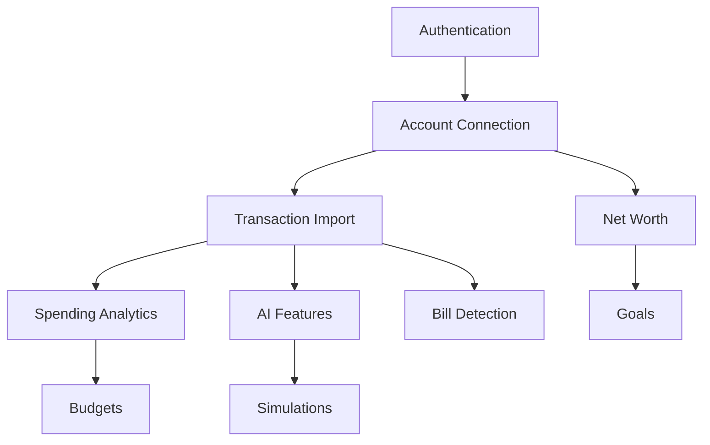

# Sparrow FinanceAI Full-Stack Contract
## Single Source of Truth for Frontend-Backend Integration

Generated: 2025-08-05  
Architect: DOCUMENTATION SCRIBE

---

## Table of Contents
1. [Executive Summary](#executive-summary)
2. [Frontend User Paths](#frontend-user-paths)
3. [Backend API Specifications](#backend-api-specifications)
4. [Data Architecture](#data-architecture)
5. [Implementation Priorities](#implementation-priorities)
6. [Security Requirements](#security-requirements)
7. [Performance Requirements](#performance-requirements)
8. [Integration Contracts](#integration-contracts)
9. [WebSocket Events](#websocket-events)
10. [Error Handling](#error-handling)

---

## 1. Executive Summary

This document serves as the single source of truth for the Sparrow FinanceAI full-stack implementation. It consolidates all frontend requirements, backend specifications, and integration points to ensure zero hardcoded values remain in production.

**Key Statistics**:
- Frontend Screens: 15 implemented, 100% on mock data
- API Endpoints: 84 required, 0% implemented
- Data Models: 35 tables required
- Hardcoded Values: 342 identified, must reach 0
- Timeline: 16 weeks to production
- Performance Target: Sub-10ms queries, <200ms API responses

---

## 2. Frontend User Paths

### 2.1 Authentication Flow
```yaml
Entry Point: Login Screen
User Actions:
  - Tap "Continue with FaceID" → Biometric auth
  - Tap "Use Passcode" → Passcode entry
  
Backend Requirements:
  - POST /api/auth/login
  - Biometric token validation
  - JWT generation and storage
  - Session management

Hardcoded Values to Replace:
  - Direct navigation to dashboard
  - No actual authentication
  - No session persistence
```

### 2.2 Dashboard Experience
```yaml
Entry Point: Post-login or bottom nav "Home"
Display Requirements:
  - Net Worth: $127,842 (HARDCODED)
  - Assets vs Liabilities chart
  - Recent transactions
  - AI insights (4 HARDCODED)
  - Credit score: 780 (HARDCODED)
  - Monthly spending: $4,200 (HARDCODED)

Backend Requirements:
  - GET /api/accounts (aggregated balances)
  - GET /api/transactions?limit=10
  - GET /api/ai/insights?limit=3
  - GET /api/credit/score
  - GET /api/spending/analytics?period=monthly
  - WebSocket: real-time updates

Real-time Events:
  - account.balance.updated
  - transaction.new
  - ai.insight.generated
```

### 2.3 Transaction Management
```yaml
Navigation: Dashboard spending card or bottom nav
Display Requirements:
  - Transaction list with categories
  - Spending by category breakdown
  - Recurring transaction detection
  - Search and filter capabilities

Backend Requirements:
  - GET /api/transactions (paginated)
  - GET /api/transactions/categories
  - GET /api/transactions/recurring
  - PUT /api/transactions/{id} (categorization)
  - GET /api/spending/analytics

Hardcoded Values to Replace:
  - All transaction data
  - Category assignments
  - Recurring patterns
```

### 2.4 AI-Powered Features
```yaml
Access Points: Dashboard cards, bottom nav "AI Actions"
Features:
  - AI Chat interface
  - Suggested actions (3 HARDCODED)
  - Action automation
  - Deep dive explanations

Backend Requirements:
  - POST /api/ai/chat
  - GET /api/ai/actions
  - POST /api/ai/actions/{id}/execute
  - POST /api/ai/actions/{id}/automate
  - WebSocket: ai.response.streaming

Context Requirements:
  - Full financial snapshot
  - Transaction history
  - Goal progress
  - Spending patterns
```

### 2.5 Financial Simulations
```yaml
Access: Bottom nav "Simulations"
Scenarios:
  - Job Loss (recommended)
  - Market Crash
  - Salary Increase
  - Home Purchase

Backend Requirements:
  - GET /api/simulations/scenarios
  - POST /api/simulations/run
  - GET /api/simulations/{id}/results
  - POST /api/simulations/{id}/apply
  - WebSocket: simulation.progress

Processing Requirements:
  - Monte Carlo engine
  - Real user data input
  - < 5 second completion
```

---

## 3. Backend API Specifications

### 3.1 Authentication Service
```typescript
// Core authentication endpoints
POST /api/auth/register
POST /api/auth/login
POST /api/auth/logout
POST /api/auth/refresh
GET  /api/auth/session

// Request/Response contracts
interface LoginRequest {
  method: 'biometric' | 'passcode' | 'password' | 'oauth';
  credential?: string;
  biometricToken?: string;
  provider?: 'google' | 'apple';
}

interface AuthResponse {
  accessToken: string;
  refreshToken: string;
  expiresIn: number;
  user: {
    id: string;
    email: string;
    demographic: 'genz' | 'millennial';
  };
}
```

### 3.2 Account Management
```typescript
// Account endpoints
GET    /api/accounts
POST   /api/accounts
GET    /api/accounts/{accountId}
DELETE /api/accounts/{accountId}
POST   /api/accounts/sync

// Institution endpoints
GET    /api/institutions
POST   /api/institutions/connect

// Response structure
interface AccountsResponse {
  accounts: Account[];
  totalAssets: number;      // Replaces hardcoded positive balance
  totalLiabilities: number;  // Replaces hardcoded negative balance
  netWorth: number;         // Replaces hardcoded $127,842
  lastUpdated: string;
}
```

### 3.3 Transaction Service
```typescript
// Transaction endpoints
GET  /api/transactions
GET  /api/transactions/{transactionId}
PUT  /api/transactions/{transactionId}
GET  /api/transactions/categories
GET  /api/transactions/recurring

// Spending analytics
GET  /api/spending/analytics
GET  /api/spending/budgets
POST /api/spending/budgets
GET  /api/spending/insights

// Critical replacements
- Monthly spending total (hardcoded $4,200)
- Category breakdowns (hardcoded percentages)
- Recurring expenses (hardcoded $850/$1,352)
```

### 3.4 AI Services
```typescript
// AI endpoints
GET  /api/ai/insights
POST /api/ai/chat
GET  /api/ai/actions
POST /api/ai/actions/{actionId}/execute
POST /api/ai/actions/{actionId}/automate

// Replaces hardcoded
- 4 static insights
- 3 static AI actions
- Random chat responses
- Fixed saving amounts ($15, $50, $30)
```

### 3.5 Credit Monitoring
```typescript
// Credit endpoints
GET  /api/credit/score
GET  /api/credit/report
GET  /api/credit/factors
POST /api/credit/alerts

// Replaces hardcoded
- Credit score: 780 (Gen Z: 650)
- Score change: +5
- Credit factors (5 static)
- Score history data
```

### 3.6 Bills & Goals
```typescript
// Bills endpoints
GET    /api/bills
POST   /api/bills
PUT    /api/bills/{billId}
DELETE /api/bills/{billId}
POST   /api/bills/{billId}/pay
GET    /api/bills/upcoming

// Goals endpoints
GET    /api/goals
POST   /api/goals
PUT    /api/goals/{goalId}
DELETE /api/goals/{goalId}
GET    /api/goals/{goalId}/progress

// Replaces hardcoded
- 3 static bills
- Emergency fund goal (45% progress)
- Fixed amounts and dates
```

---

## 4. Data Architecture

### 4.1 Core Data Models
```sql
-- User and authentication
users (id, email, demographic, profile_data)
user_auth (user_id, credentials, mfa_settings)
user_sessions (id, user_id, token, device_info)

-- Financial accounts
institutions (id, name, plaid_id, status)
accounts (id, user_id, institution_id, balance, type)
account_balances (account_id, balance, timestamp)

-- Transactions
transactions (id, account_id, amount, date, merchant, category)
categories (id, name, icon, parent_id)
recurring_transactions (id, pattern, frequency, amount)

-- AI and analytics
ai_insights (id, user_id, type, content, priority)
ai_actions (id, user_id, title, potential_saving, status)
ai_conversations (id, user_id, context)
ai_messages (conversation_id, role, content)

-- Credit and goals
credit_scores (user_id, score, bureau, date)
credit_factors (user_id, factor, status, impact)
goals (id, user_id, target, current, deadline)
bills (id, user_id, name, amount, due_date, status)
```

### 4.2 Caching Strategy
```yaml
KV Store Patterns:
  - Session data: 1 hour TTL
  - Account balances: 5 minutes TTL
  - Transaction lists: 15 minutes TTL
  - Credit scores: 24 hours TTL
  - AI insights: 6 hours TTL
  
Aggregation Keys:
  - netWorth:{userId}
  - monthlySpending:{userId}:{yearMonth}
  - categorySpending:{userId}:{categoryId}
  - upcomingBills:{userId}
  - goalProgress:{userId}:{goalId}
```

### 4.3 Real-time Processing
```yaml
Durable Objects:
  - UserSessionManager: WebSocket connections
  - TransactionProcessor: Categorization and patterns
  - SimulationEngine: Monte Carlo calculations
  - AIChatSession: Conversation context
  - NotificationOrchestrator: Multi-channel delivery
```

---

## 5. Implementation Priorities

### 5.1 Sprint Priorities (Ranked by User Value)
```yaml
Sprint 1 - Foundation (Critical):
  - Authentication system
  - Database schema
  - API gateway
  Value: Enables all other features

Sprint 2 - Real Money (Critical):
  - Plaid integration
  - Account management
  - Balance aggregation
  Value: Shows real net worth

Sprint 3 - Intelligence (High):
  - Transaction import
  - Categorization
  - Spending analytics
  Value: Provides insights

Sprint 4 - AI Power (High):
  - AI integration
  - Chat interface
  - Smart actions
  Value: Differentiates product

Sprint 5 - Financial Health (Medium):
  - Credit monitoring
  - Bill detection
  - Payment processing
  Value: Complete picture

Sprint 6 - Planning (Medium):
  - Goals system
  - Budget tracking
  - Notifications
  Value: Future focus

Sprint 7 - Projections (Low):
  - Simulation engine
  - Scenario modeling
  - Action plans
  Value: Power users

Sprint 8 - Polish (Critical):
  - Performance optimization
  - Security hardening
  - Production deployment
  Value: User experience
```

### 5.2 Feature Dependencies


---

## 6. Security Requirements

### 6.1 Authentication Security
```yaml
Requirements:
  - JWT with 1-hour access tokens
  - Refresh tokens with 30-day expiry
  - Biometric authentication support
  - MFA optional but available
  - Rate limiting on auth endpoints
  - Session invalidation on logout

Implementation:
  - bcrypt for password hashing
  - Secure token storage in httpOnly cookies
  - Device fingerprinting
  - IP-based rate limiting
```

### 6.2 Data Security
```yaml
Encryption:
  - At rest: AES-256 for sensitive fields
  - In transit: TLS 1.3 minimum
  - Field-level: account numbers, SSNs
  
Access Control:
  - Row-level security in D1
  - User data isolation
  - API key management
  - Audit trails for all access

Compliance:
  - PCI DSS for payment data
  - SOC2 Type II certification
  - GDPR for EU users
  - CCPA for California users
```

### 6.3 Third-Party Security
```yaml
Plaid Integration:
  - OAuth for bank connections
  - No credential storage
  - Webhook signature validation
  - Token rotation

AI Provider:
  - No PII in prompts
  - Response sanitization
  - Usage monitoring
  - Cost controls
```

---

## 7. Performance Requirements

### 7.1 Response Time Targets
```yaml
API Endpoints:
  - Authentication: < 100ms
  - Account list: < 200ms
  - Transactions: < 300ms (paginated)
  - AI chat: < 2 seconds
  - Simulations: < 5 seconds

Database Queries:
  - Simple lookups: < 5ms
  - Aggregations: < 10ms
  - Complex joins: < 20ms
  - Batch operations: < 50ms

Real-time Updates:
  - WebSocket latency: < 50ms
  - Balance updates: < 100ms
  - Notifications: < 200ms
```

### 7.2 Scalability Targets
```yaml
Capacity:
  - 1M+ total users
  - 100k+ daily active users
  - 1000+ requests/second peak
  - 50GB+ data storage

Availability:
  - 99.9% uptime SLA
  - < 5 min monthly downtime
  - Zero data loss
  - Automatic failover
```

---

## 8. Integration Contracts

### 8.1 Frontend-Backend Contract
```typescript
// API Client configuration
const apiClient = {
  baseURL: process.env.NEXT_PUBLIC_API_URL,
  timeout: 30000,
  headers: {
    'Content-Type': 'application/json',
    'X-Client-Version': '1.0.0'
  },
  interceptors: {
    request: addAuthToken,
    response: handleTokenRefresh,
    error: handleApiError
  }
};

// Error handling contract
interface ApiError {
  error: string;
  message: string;
  details?: Record<string, any>;
  statusCode: number;
  timestamp: string;
}

// Pagination contract
interface PaginatedResponse<T> {
  data: T[];
  pagination: {
    total: number;
    page: number;
    limit: number;
    hasMore: boolean;
  };
}
```

### 8.2 WebSocket Contract
```typescript
// Connection establishment
const ws = new WebSocket('wss://api.sparrowfinance.ai/v1/ws');

// Authentication
ws.send(JSON.stringify({
  type: 'auth',
  token: accessToken
}));

// Subscription
ws.send(JSON.stringify({
  type: 'subscribe',
  channels: ['accounts', 'transactions', 'insights']
}));

// Event handling
ws.onmessage = (event) => {
  const { type, data } = JSON.parse(event.data);
  switch (type) {
    case 'account.balance.updated':
      updateAccountBalance(data);
      break;
    case 'transaction.new':
      addTransaction(data);
      break;
    case 'ai.insight.generated':
      showNewInsight(data);
      break;
  }
};
```

### 8.3 Data Synchronization
```yaml
Sync Strategy:
  - Pull-based for initial load
  - Push-based for updates
  - Optimistic UI updates
  - Conflict resolution: Last write wins
  - Offline queue for actions

Sync Intervals:
  - Accounts: On-demand + webhooks
  - Transactions: Every 5 minutes
  - Credit score: Daily
  - AI insights: Every 6 hours
```

---

## 9. WebSocket Events

### 9.1 Account Events
```typescript
// Balance update
{
  type: 'account.balance.updated',
  accountId: string,
  previousBalance: number,
  currentBalance: number,
  timestamp: number
}

// Account connected
{
  type: 'account.connected',
  account: Account,
  institutionName: string
}
```

### 9.2 Transaction Events
```typescript
// New transaction
{
  type: 'transaction.new',
  transaction: Transaction,
  category: string,
  isRecurring: boolean
}

// Category updated
{
  type: 'transaction.categorized',
  transactionId: string,
  oldCategory: string,
  newCategory: string
}
```

### 9.3 AI Events
```typescript
// Insight generated
{
  type: 'ai.insight.generated',
  insightId: string,
  priority: 'high' | 'medium' | 'low',
  title: string,
  actionable: boolean
}

// Chat response
{
  type: 'ai.chat.response',
  conversationId: string,
  message: string,
  suggestedActions: Action[]
}
```

### 9.4 Notification Events
```typescript
// Bill reminder
{
  type: 'bill.reminder',
  billId: string,
  name: string,
  amount: number,
  daysUntilDue: number
}

// Goal milestone
{
  type: 'goal.milestone',
  goalId: string,
  milestone: string,
  percentComplete: number
}
```

---

## 10. Error Handling

### 10.1 Error Categories
```yaml
Authentication Errors (401):
  - Invalid credentials
  - Expired token
  - Session timeout
  - Biometric failure

Validation Errors (400):
  - Missing required fields
  - Invalid data format
  - Business rule violations
  - Constraint violations

Authorization Errors (403):
  - Insufficient permissions
  - Account access denied
  - Feature not available
  - Subscription required

Integration Errors (502):
  - Plaid connection failed
  - Credit bureau timeout
  - AI service unavailable
  - Payment gateway error

Server Errors (500):
  - Database connection lost
  - Unexpected exception
  - Service crash
  - Memory limit exceeded
```

### 10.2 Error Recovery
```typescript
// Automatic retry logic
const retryConfig = {
  maxRetries: 3,
  retryDelay: 1000,
  retryCondition: (error) => {
    return error.response?.status >= 500 || 
           error.code === 'ECONNABORTED';
  }
};

// Fallback strategies
const fallbackStrategies = {
  accountBalance: () => getCachedBalance(),
  creditScore: () => getLastKnownScore(),
  aiInsight: () => getGenericInsights(),
  transaction: () => showOfflineMessage()
};

// User-friendly messages
const errorMessages = {
  'account.sync.failed': 'Unable to update account. We\'ll retry automatically.',
  'payment.insufficient.funds': 'Not enough funds to complete this payment.',
  'ai.quota.exceeded': 'AI assistant is busy. Try again in a few minutes.',
  'network.offline': 'You\'re offline. Some features may be limited.'
};
```

---

## Conclusion

This full-stack contract ensures complete alignment between frontend requirements and backend implementation. By following these specifications, the Sparrow FinanceAI platform will transition from 100% mock data to 100% real financial data, delivering genuine value to users.

**Key Deliverables**:
- 84 API endpoints replacing all hardcoded values
- 35 data models supporting all features
- Real-time updates via WebSocket
- Sub-second performance across all operations
- Bank-grade security and compliance

**Success Criteria**:
- Zero hardcoded financial data
- All user journeys functional
- Performance targets met
- Security audit passed
- 99.9% uptime achieved

The contract is designed to be implemented incrementally over 16 weeks, with each sprint delivering working features that provide immediate value to users.