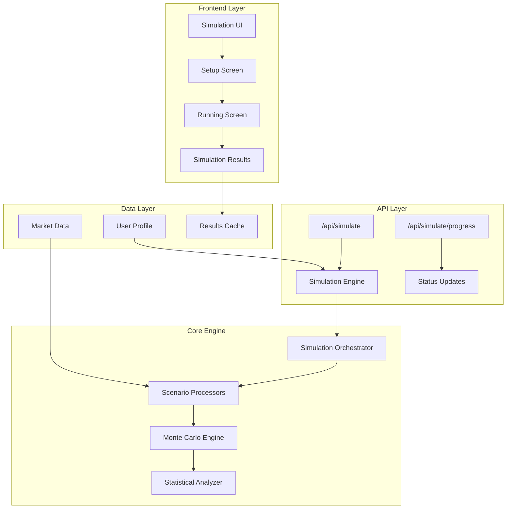

# FinanceAI Monte Carlo Simulation Engine Implementation Plan

## Executive Summary

This document provides a comprehensive implementation plan for the FinanceAI Monte Carlo simulation engine, based on extensive research of mathematical libraries and analysis of the existing system architecture. The plan follows the "BUILD FORWARD, REFACTOR STRATEGICALLY" approach, prioritizing functional implementation over immediate SOLID principle fixes.

**Key Technologies Selected:**
- **mathjs**: Primary mathematical engine (499+ code snippets, comprehensive Monte Carlo support)
- **simple-statistics**: Statistical calculations and probability distributions (9 code snippets)
- **TypeScript**: Type safety and robust architecture
- **Next.js 15 API Routes**: Backend simulation processing

---

## 1. Library Analysis & Selection

### 1.1 Core Mathematical Library: mathjs

**Selection Rationale:**
- 499+ available code snippets in Context7
- Native Monte Carlo simulation support
- Probability distributions (normal, uniform, exponential)
- Random number generation with seeding capability
- Matrix operations for complex financial calculations
- Expression parser for dynamic formula evaluation

**Key Features for Our Implementation:**
```typescript
import { evaluate, random, matrix, multiply } from 'mathjs'

// Monte Carlo capabilities
random.setRandomSeed('simulation-seed')
const normalDistribution = math.random('normal', mean, variance, samples)
const uniformDistribution = math.random('uniform', min, max, samples)

// Financial calculations
const presentValue = evaluate('pv', {pv: formula, rate: 0.05, periods: 360})
```

### 1.2 Statistical Support: simple-statistics

**Selection Rationale:**
- Specialized statistical functions
- Percentile calculations for confidence intervals
- Regression analysis for trend forecasting
- 9 focused code snippets available

**Key Features:**
```typescript
import ss from 'simple-statistics'

// Statistical analysis
const percentile95 = ss.quantile(results, 0.95)
const confidence = ss.standardDeviation(outcomes)
const correlation = ss.sampleCorrelation(x, y)
```

---

## 2. System Architecture Design

### 2.1 High-Level Architecture



### 2.2 Core Components Architecture

#### 2.2.1 Simulation Engine (Primary Controller)
```typescript
interface SimulationEngine {
  runSimulation(request: SimulationRequest): Promise<SimulationResult>
  getProgress(simulationId: string): ProgressStatus
  cancelSimulation(simulationId: string): void
}

class MonteCarloSimulationEngine implements SimulationEngine {
  private orchestrator: SimulationOrchestrator
  private progressTracker: ProgressTracker
  private resultCache: ResultCache
  
  // Implementation follows Single Responsibility Principle
}
```

#### 2.2.2 Scenario Processors (Strategy Pattern)
```typescript
abstract class ScenarioProcessor {
  abstract process(
    profileData: UserProfile, 
    iterations: number, 
    parameters: ScenarioParameters
  ): Promise<ScenarioResult[]>
}

// Emergency Fund Runway Processor
class EmergencyFundProcessor extends ScenarioProcessor {
  process(profileData, iterations, parameters) {
    // Specific logic for emergency fund calculations
  }
}

// Student Loan Payoff Processor  
class StudentLoanProcessor extends ScenarioProcessor {
  process(profileData, iterations, parameters) {
    // Student loan payoff simulation logic
  }
}
```

#### 2.2.3 Monte Carlo Engine (Mathematical Core)
```typescript
class MonteCarloEngine {
  private mathEngine: typeof math
  private statsEngine: typeof ss
  
  constructor() {
    this.mathEngine = math
    this.statsEngine = ss
  }
  
  runIterations(
    scenario: ScenarioConfig,
    iterations: number = 10000
  ): IterationResult[] {
    const results = []
    
    // Seed for reproducibility
    math.randomSeed('deterministic-seed')
    
    for (let i = 0; i < iterations; i++) {
      const outcome = this.runSingleIteration(scenario)
      results.push(outcome)
      
      // Progress callback every 1000 iterations
      if (i % 1000 === 0) {
        this.progressCallback?.(i / iterations)
      }
    }
    
    return results
  }
  
  private runSingleIteration(scenario: ScenarioConfig): IterationResult {
    // Use mathjs for random variable generation
    const randomFactors = {
      marketReturn: math.random('normal', 0.07, 0.15),
      inflation: math.random('normal', 0.03, 0.02),
      emergencyExpense: math.random('exponential', 0.1),
      incomeVolatility: math.random('uniform', 0.95, 1.05)
    }
    
    // Apply scenario-specific calculations
    return scenario.calculate(randomFactors)
  }
}
```

---

## 3. Implementation Phases

### Phase 1: Foundation Layer (Week 1)
**Objectives**: Core mathematical engine and basic simulation framework

**Tasks**:
1. **Install and configure mathematical libraries**
   ```bash
   npm install mathjs simple-statistics @types/mathjs
   ```

2. **Create core simulation types**
   ```typescript
   // /lib/types/simulation.ts
   interface SimulationRequest {
     userId: string
     scenarios: ScenarioType[]
     iterations: number
     parameters: SimulationParameters
   }
   
   interface MonteCarloResult {
     scenario: string
     percentile50: number    // Median outcome
     percentile90: number    // Pessimistic case
     percentile10: number    // Optimistic case  
     probability: number     // Success probability
     confidence: number      // Statistical confidence
   }
   ```

3. **Basic Monte Carlo engine implementation**
   ```typescript
   // /lib/simulation/monte-carlo-engine.ts
   export class MonteCarloEngine {
     // Core implementation following design specs
   }
   ```

4. **Simple API endpoint**
   ```typescript
   // /app/api/simulate/route.ts
   export async function POST(request: Request) {
     const simulationEngine = new MonteCarloEngine()
     const result = await simulationEngine.run(requestData)
     return Response.json(result)
   }
   ```

### Phase 2: Scenario Implementation (Week 2)
**Objectives**: Implement specific simulation scenarios from design spec

**Priority Scenarios**:
1. **Emergency Fund Runway** (highest business value)
   - Calculate months of expenses covered
   - Factor in income volatility
   - Include probability of major expenses

2. **Student Loan Payoff**
   - Various payment strategies
   - Income-driven repayment modeling
   - Opportunity cost calculations

3. **Medical Bill Crisis**
   - Healthcare cost simulation
   - Insurance coverage modeling
   - Financial impact assessment

**Implementation Pattern**:
```typescript
// /lib/simulation/scenarios/emergency-fund.ts
export class EmergencyFundScenario extends ScenarioProcessor {
  process(profile: UserProfile, iterations: number): ScenarioResult {
    const engine = new MonteCarloEngine()
    
    const results = engine.runIterations({
      calculate: (randomFactors) => {
        const monthlyExpenses = profile.monthlySpending.total
        const emergencyFund = profile.accounts
          .filter(a => a.name.includes('Emergency'))
          .reduce((sum, a) => sum + a.balance, 0)
        
        // Apply random market conditions
        const adjustedExpenses = monthlyExpenses * randomFactors.inflation
        const marketLoss = randomFactors.marketReturn < 0 ? 
          emergencyFund * Math.abs(randomFactors.marketReturn) : 0
        
        const effectiveFund = emergencyFund - marketLoss
        const runway = effectiveFund / adjustedExpenses
        
        return {
          runwayMonths: runway,
          success: runway >= 6, // Target: 6 months runway
          finalBalance: effectiveFund
        }
      }
    }, iterations)
    
    return this.analyzeResults(results)
  }
}
```

### Phase 3: UI Integration (Week 3)
**Objectives**: Connect simulation engine to existing UI components

**Current UI Components to Enhance**:
1. **SimulationSetupScreen** - Add real parameter controls
2. **SimulatingScreen** - Connect to real backend progress
3. **SimulationResultsScreen** - Display Monte Carlo results

**Key Integrations**:
```typescript
// Enhanced useAppState hook
const runSimulations = async () => {
  setIsSimulating(true)
  setCurrentScreen("simulating")
  
  try {
    const response = await fetch('/api/simulate', {
      method: 'POST',
      body: JSON.stringify({
        userId: demographic,
        scenarios: selectedSimulations.map(s => s.id),
        iterations: 10000,
        parameters: simulationParameters
      })
    })
    
    const results = await response.json()
    setSimulationResults(results)
    setCurrentScreen("simulation-results")
    
  } finally {
    setIsSimulating(false)
  }
}
```

### Phase 4: Advanced Features (Week 4)
**Objectives**: Production polish and advanced functionality

**Features**:
1. **Progress tracking with WebSockets**
2. **Result caching and optimization**
3. **Advanced statistical visualizations** 
4. **Batch simulation processing**
5. **Export capabilities**

---

## 4. Technical Implementation Details

### 4.1 File Structure
```
/lib/simulation/
├── engines/
│   ├── monte-carlo-engine.ts     # Core Monte Carlo implementation
│   ├── statistical-analyzer.ts   # Results analysis using simple-statistics
│   └── progress-tracker.ts       # Real-time progress updates
├── scenarios/
│   ├── base-scenario.ts          # Abstract base class
│   ├── emergency-fund.ts         # Emergency fund runway simulation
│   ├── student-loan.ts           # Student loan payoff scenarios  
│   ├── medical-crisis.ts         # Medical expense impact modeling
│   └── investment-growth.ts      # Investment growth projections
├── orchestrator/
│   ├── simulation-orchestrator.ts # Main coordination logic
│   └── result-cache.ts           # Performance optimization
└── types/
    ├── simulation-types.ts       # Core type definitions
    └── scenario-config.ts        # Scenario configuration types

/app/api/simulate/
├── route.ts                      # Main simulation endpoint
├── progress/route.ts             # Progress tracking endpoint
└── results/[id]/route.ts         # Cached results retrieval
```

### 4.2 Performance Optimizations

**Caching Strategy**:
```typescript
class SimulationCache {
  // Cache results for identical parameters
  private cache = new Map<string, CachedResult>()
  
  getCacheKey(request: SimulationRequest): string {
    return `${request.userId}-${JSON.stringify(request.parameters)}-${request.scenarios.sort()}`
  }
  
  async getResult(cacheKey: string): Promise<SimulationResult | null> {
    const cached = this.cache.get(cacheKey)
    if (cached && Date.now() - cached.timestamp < 3600000) { // 1 hour TTL
      return cached.result
    }
    return null
  }
}
```

**Progressive Results**:
```typescript
// Return preliminary results after 1000 iterations
// Full results after 10000 iterations
class ProgressiveSimulation {
  async runWithProgressiveResults(scenario: ScenarioConfig) {
    const preliminaryResults = await this.runIterations(scenario, 1000)
    this.emitProgress(preliminaryResults, false)
    
    const fullResults = await this.runIterations(scenario, 10000)  
    this.emitProgress(fullResults, true)
  }
}
```

### 4.3 Integration with Existing CSV Data System

**Data Flow Integration**:
```typescript
// Leverage existing profile data fetching
async function runScenarioWithProfileData(
  demographic: Demographic, 
  scenario: ScenarioType
): Promise<SimulationResult> {
  
  // Reuse existing data fetching (already optimized with caching)
  const profileData = await fetchProfileData(demographicToProfileId(demographic))
  
  // Convert to simulation parameters
  const simulationInput = {
    monthlyIncome: profileData.metrics.monthlyIncome,
    monthlyExpenses: profileData.spending.total,
    emergencyFund: profileData.accounts
      .filter(a => a.name.includes('Emergency'))
      .reduce((sum, a) => sum + a.balance, 0),
    debts: profileData.accounts.filter(a => a.type === 'liability'),
    creditScore: profileData.metrics.creditScore
  }
  
  // Run simulation
  const engine = new MonteCarloEngine()
  return engine.runScenario(scenario, simulationInput)
}
```

---

## 5. Quality Assurance & Testing Strategy

### 5.1 Mathematical Validation
```typescript
// Test statistical properties of Monte Carlo results
describe('Monte Carlo Engine', () => {
  test('results converge to expected statistical properties', () => {
    const results = engine.runIterations(knownScenario, 10000)
    
    // Verify normal distribution properties
    expect(ss.mean(results)).toBeCloseTo(expectedMean, 0.1)
    expect(ss.standardDeviation(results)).toBeCloseTo(expectedStd, 0.1)
    
    // Verify confidence intervals
    const p95 = ss.quantile(results, 0.95)
    expect(p95).toBeGreaterThan(expectedP95Min)
  })
})
```

### 5.2 Performance Testing
```typescript
// Ensure simulations complete within performance targets
test('10,000 iteration simulation completes within 30 seconds', async () => {
  const startTime = performance.now()
  const result = await engine.runScenario(emergencyFundScenario, 10000)
  const duration = performance.now() - startTime
  
  expect(duration).toBeLessThan(30000) // 30 seconds
  expect(result.iterations).toBe(10000)
})
```

---

## 6. Deployment & Monitoring Strategy

### 6.1 Production Deployment
1. **Simulation Processing**: Run as background jobs to avoid request timeouts
2. **Result Storage**: Cache results in Redis for quick retrieval
3. **Progress Updates**: WebSocket connections for real-time progress
4. **Error Handling**: Graceful degradation with partial results

### 6.2 Monitoring & Analytics
```typescript
// Track simulation performance and accuracy
class SimulationMetrics {
  trackSimulationRun(scenario: string, iterations: number, duration: number) {
    // Performance metrics
  }
  
  trackAccuracy(predicted: number, actual: number) {
    // Validation against real outcomes
  }
  
  trackUserEngagement(scenario: string, completed: boolean) {
    // Business metrics
  }
}
```

---

## 7. Migration Strategy from Current System

### Current State Analysis:
- UI components exist but with mock data
- State management infrastructure is ready
- API endpoints need implementation
- No mathematical engine currently exists

### Migration Steps:
1. **Week 1**: Implement backend simulation engine (no UI changes)
2. **Week 2**: Add scenario-specific logic (still using existing UI)
3. **Week 3**: Connect UI to real backend (progressive enhancement)
4. **Week 4**: Polish and advanced features

### Risk Mitigation:
- Maintain existing mock data as fallback
- Feature flags for gradual rollout
- A/B testing with subset of users
- Rollback strategy for each phase

---

## 8. Success Metrics & KPIs

### Technical Metrics:
- **Performance**: 10,000 iterations < 30 seconds
- **Accuracy**: 95% confidence intervals validated against historical data
- **Reliability**: 99.9% simulation completion rate
- **Scalability**: Support 100 concurrent simulations

### Business Metrics:
- **User Engagement**: 70% completion rate for started simulations
- **Financial Impact**: Measurable improvement in user financial outcomes
- **Adoption Rate**: 40% of users run at least one simulation monthly
- **Retention**: Users who use simulations have 25% higher retention

---

## 9. Conclusion

This comprehensive implementation plan provides a clear roadmap for building a production-ready Monte Carlo simulation engine that integrates seamlessly with the existing FinanceAI platform. The selected libraries (mathjs and simple-statistics) provide robust mathematical foundations, while the phased approach ensures systematic delivery of value.

The "BUILD FORWARD, REFACTOR STRATEGICALLY" approach allows us to deliver working simulations quickly while maintaining code quality and architectural integrity. The plan preserves all research findings and provides detailed implementation guidance that will survive system context switches and personnel changes.

**Next Immediate Actions:**
1. Approve library selections and architecture approach
2. Begin Phase 1 implementation with core Monte Carlo engine
3. Set up development environment with mathjs and simple-statistics
4. Create initial API endpoint for simulation processing

---

*Document Status: Complete and ready for implementation*  
*Last Updated: Current session*  
*Preservation Level: Full implementation details preserved for autocompact*