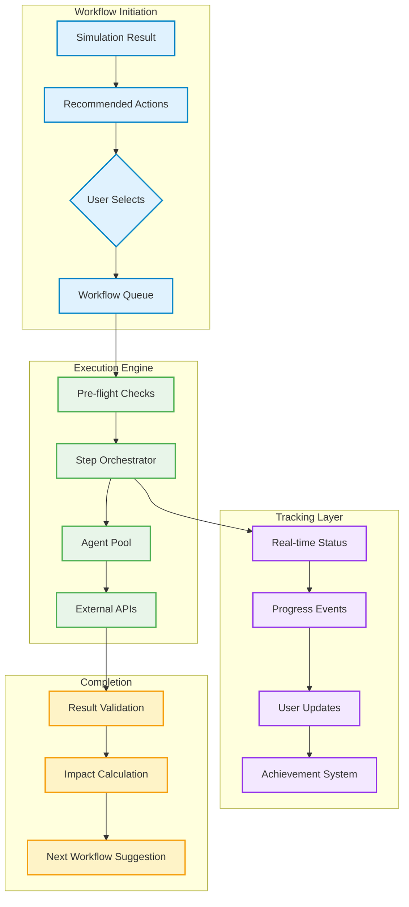
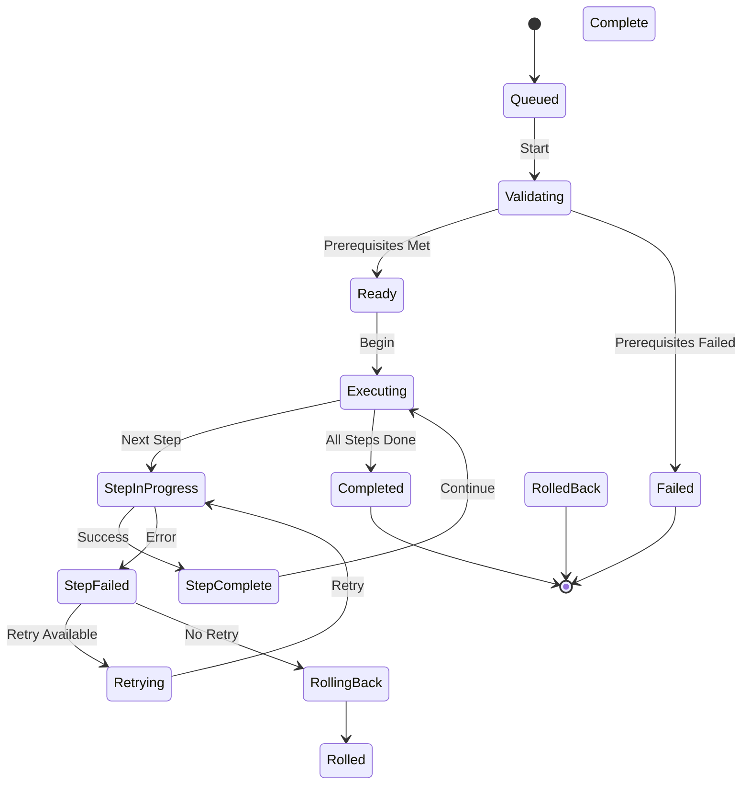
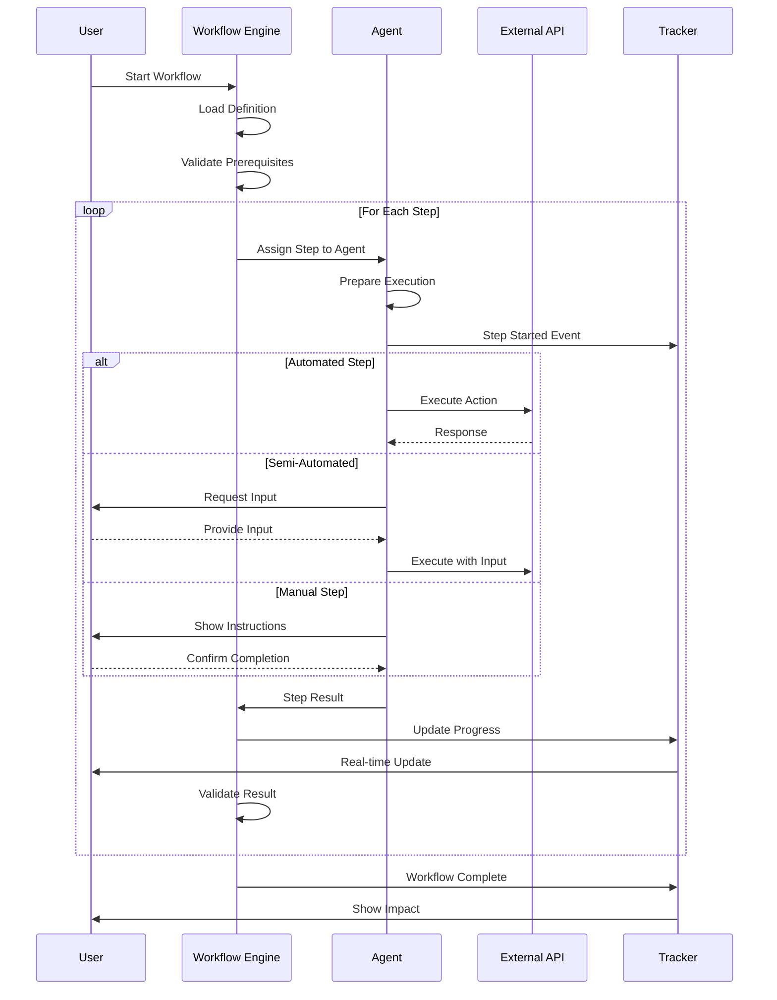
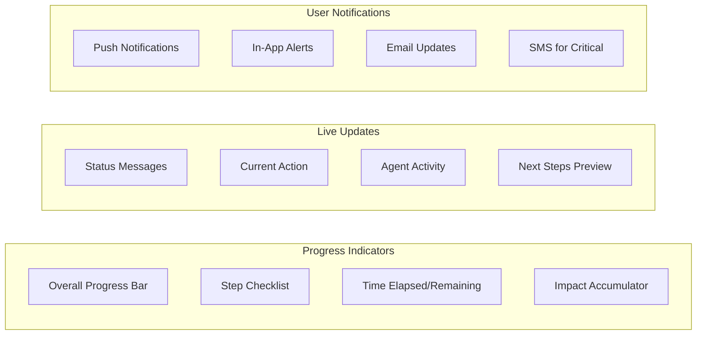
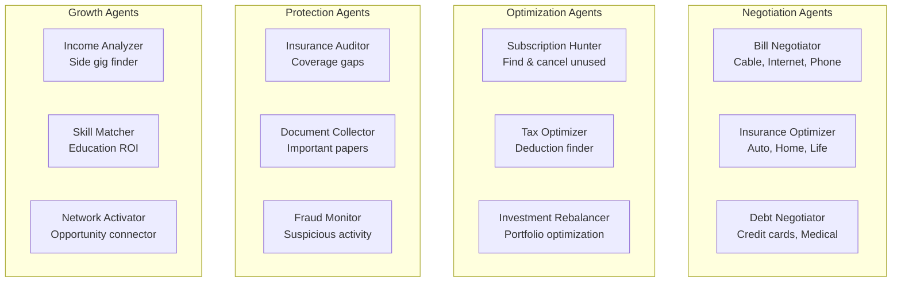
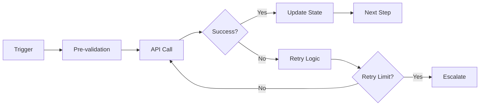
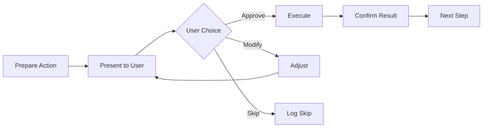
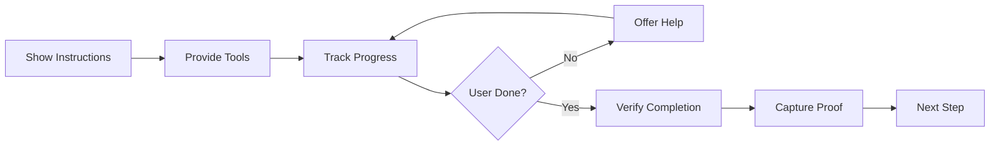
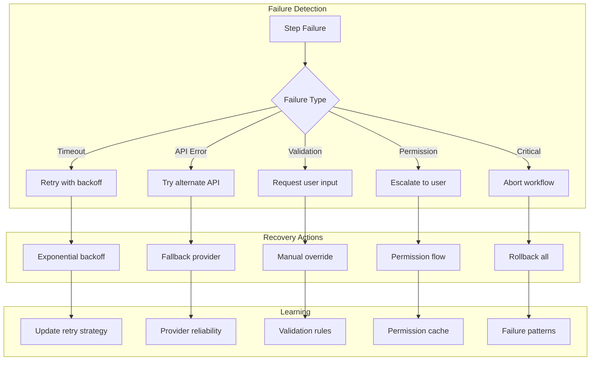

# Discrete Workflow Automation System

## Table of Contents
1. [Automation Architecture](#automation-architecture)
2. [Workflow Execution Engine](#workflow-execution-engine)
3. [Real-Time Tracking System](#real-time-tracking-system)
4. [Agent Facilitation Framework](#agent-facilitation-framework)
5. [Workflow Catalog](#workflow-catalog)
6. [Step Execution Patterns](#step-execution-patterns)
7. [Failure & Recovery Mechanisms](#failure--recovery-mechanisms)

---

## Automation Architecture

### System Overview



### Core Components

**1. Workflow Definition Language**
```typescript
interface WorkflowDefinition {
  id: string;
  name: string;
  category: 'optimize' | 'protect' | 'grow' | 'emergency';
  
  triggers: TriggerCondition[];
  prerequisites: Prerequisite[];
  
  steps: WorkflowStep[];
  rollbackPlan: RollbackStep[];
  
  estimatedDuration: DurationRange;
  estimatedImpact: ImpactMetrics;
  
  agents: RequiredAgent[];
  externalDependencies: string[];
}

interface WorkflowStep {
  id: string;
  name: string;
  description: string;
  
  type: 'automated' | 'semi-automated' | 'manual';
  agent: AgentType;
  
  inputs: StepInput[];
  actions: StepAction[];
  outputs: StepOutput[];
  
  validations: Validation[];
  retryPolicy: RetryPolicy;
  timeout: number;
  
  userInteraction?: UserInteraction;
  trackingEvents: TrackingEvent[];
}
```

**2. Execution State Machine**


---

## Workflow Execution Engine

### Step-by-Step Execution Model



### Execution Strategies

**1. Parallel Execution**
- Steps without dependencies run simultaneously
- Resource pooling for agent availability
- Conflict detection and resolution
- Progress aggregation across parallel paths

**2. Conditional Branching**
- Dynamic path selection based on results
- A/B testing of workflow variations
- User preference learning
- Fallback path activation

**3. Transactional Integrity**
- All-or-nothing execution groups
- Compensation transactions
- State checkpointing
- Atomic operations where critical

---

## Real-Time Tracking System

### Event Stream Architecture

```typescript
interface WorkflowEvent {
  workflowId: string;
  stepId: string;
  timestamp: number;
  
  type: EventType;
  severity: 'info' | 'warning' | 'error' | 'success';
  
  data: {
    progress: number; // 0-100
    message: string;
    details: any;
    userAction?: RequiredAction;
  };
  
  metrics: {
    duration: number;
    resourcesUsed: Resource[];
    costIncurred: number;
  };
}

enum EventType {
  // Lifecycle
  WORKFLOW_STARTED = 'workflow.started',
  WORKFLOW_COMPLETED = 'workflow.completed',
  WORKFLOW_FAILED = 'workflow.failed',
  
  // Steps
  STEP_STARTED = 'step.started',
  STEP_PROGRESS = 'step.progress',
  STEP_WAITING_USER = 'step.waiting_user',
  STEP_COMPLETED = 'step.completed',
  STEP_FAILED = 'step.failed',
  STEP_RETRYING = 'step.retrying',
  
  // Impacts
  SAVINGS_ACHIEVED = 'impact.savings',
  RISK_REDUCED = 'impact.risk_reduced',
  GOAL_PROGRESSED = 'impact.goal_progress',
  
  // Warnings
  DEPENDENCY_ISSUE = 'warning.dependency',
  PARTIAL_SUCCESS = 'warning.partial',
  MANUAL_REVIEW = 'warning.review_needed'
}
```

### Progress Visualization



### Real-Time UI Updates

```yaml
Progress Card:
  Header:
    - Workflow name
    - Overall progress (57%)
    - Estimated time remaining (12 min)
  
  Current Step:
    - "Negotiating cable bill..."
    - Agent: BillNegotiatorBot
    - Status: "On hold with retention dept"
    - Elapsed: 3:24
  
  Completed Steps: [Collapsible list]
    ✓ Gathered account info (45s)
    ✓ Analyzed usage patterns (1m 20s)
    ✓ Found better plan ($30/mo savings)
  
  Upcoming Steps: [Preview]
    - Confirm plan change
    - Update autopay
    - Set calendar reminder
  
  Live Impact:
    💰 Savings so far: $0
    📅 Annual projection: $360
    🎯 Goal impact: +2.3% progress
```

---

## Agent Facilitation Framework

### Agent Types and Specializations



### Agent Capabilities

**1. Bill Negotiator Agent**
```yaml
Capabilities:
  - API integrations with major providers
  - Script library for retention departments
  - Competitive pricing database
  - Escalation strategies
  - Win rate tracking

Execution Pattern:
  1. Gather account details
  2. Research competitive rates
  3. Calculate customer lifetime value
  4. Initiate contact via appropriate channel
  5. Execute negotiation script
  6. Handle objections
  7. Secure better rate or flag for human
  8. Update billing immediately
  9. Set reminder for re-negotiation

Success Metrics:
  - Average savings: $47/month
  - Success rate: 73%
  - Time to complete: 8-45 minutes
```

**2. Subscription Hunter Agent**
```yaml
Capabilities:
  - Transaction pattern analysis
  - Email receipt scanning
  - Usage detection algorithms
  - Cancellation link database
  - Refund identification

Execution Pattern:
  1. Scan last 12 months transactions
  2. Identify recurring charges
  3. Cross-reference with email receipts
  4. Check usage signals
  5. Calculate waste score
  6. Present findings with one-click cancel
  7. Execute cancellations
  8. Track savings
  9. Monitor for re-activation

Success Metrics:
  - Average subscriptions found: 3.7
  - Waste identified: $127/month
  - False positive rate: <5%
```

### Agent Communication Protocol

```typescript
interface AgentMessage {
  type: 'status' | 'request' | 'result' | 'error';
  
  content: {
    headline: string;      // User-friendly summary
    technical: string;     // Detailed logs
    visualData?: any;      // Charts, tables
    userAction?: {         // Required user input
      type: 'confirm' | 'choose' | 'input';
      options?: any[];
      timeout?: number;
    };
  };
  
  context: {
    stepProgress: number;
    confidenceLevel: number;
    alternativeActions: Action[];
  };
}
```

---

## Workflow Catalog

### 1. Emergency Fund Builder
**Trigger**: Simulation shows < 3 months runway

**Steps**:
1. **Expense Audit** (Automated)
   - Agent: SpendingAnalyzer
   - Actions: Categorize last 90 days, identify cuts
   - Output: Ranked list of reducible expenses

2. **Quick Wins** (Semi-automated)
   - Agent: QuickSaver
   - Actions: Cancel trials, downgrade services
   - User Input: Approve each cancellation

3. **Bill Negotiation** (Automated)
   - Agent: BillNegotiator
   - Actions: Call top 5 bills, negotiate rates
   - Tracking: Real-time savings counter

4. **Automation Setup** (Automated)
   - Agent: AutomationBuilder
   - Actions: Create savings rules, round-ups
   - Output: Projected monthly increase

5. **Side Income** (Manual)
   - Agent: IncomeCoach
   - Actions: Present gig options, setup guides
   - Tracking: Application progress

### 2. Debt Avalanche Accelerator
**Trigger**: High-interest debt identified

**Steps**:
1. **Debt Inventory** (Automated)
   - Complete debt picture with APIs
   - Interest rate optimization check
   - Payoff timeline calculations

2. **Transfer Opportunities** (Semi-automated)
   - 0% balance transfer hunting
   - Application pre-qualification
   - Transfer execution

3. **Payment Optimization** (Automated)
   - Reorder payment priorities
   - Setup automated extra payments
   - Create visual payoff tracker

4. **Negotiation** (Automated)
   - Contact high-rate creditors
   - Request rate reductions
   - Document new terms

### 3. Investment Tax Harvester
**Trigger**: Market volatility + unrealized losses

**Steps**:
1. **Loss Identification** (Automated)
   - Scan all taxable positions
   - Calculate harvest potential
   - Check wash sale rules

2. **Execution Planning** (Semi-automated)
   - Create sell/buy order pairs
   - User approval for each trade
   - Tax impact preview

3. **Trade Execution** (Automated)
   - Place orders via broker API
   - Monitor fills
   - Track cost basis

4. **Rebalancing** (Automated)
   - Reinvest proceeds
   - Maintain allocation targets
   - Document for taxes

---

## Step Execution Patterns

### Execution Types

**1. Fully Automated Steps**


**2. Semi-Automated Steps**


**3. Manual Guided Steps**


### Step Coordination

```typescript
class StepCoordinator {
  async executeStep(step: WorkflowStep, context: ExecutionContext) {
    // Pre-flight checks
    await this.validatePrerequisites(step, context);
    
    // Assign to appropriate agent
    const agent = await this.assignAgent(step.agent);
    
    // Setup monitoring
    const monitor = this.createStepMonitor(step.id);
    
    try {
      // Execute based on type
      let result;
      switch(step.type) {
        case 'automated':
          result = await agent.executeAutomated(step, context);
          break;
        case 'semi-automated':
          result = await this.executeWithUserInput(agent, step, context);
          break;
        case 'manual':
          result = await this.guideManualExecution(agent, step, context);
          break;
      }
      
      // Validate results
      await this.validateStepOutput(step, result);
      
      // Update state
      await this.updateWorkflowState(step.id, result);
      
      // Emit events
      this.emitStepComplete(step.id, result);
      
      return result;
      
    } catch (error) {
      return this.handleStepFailure(step, error, monitor);
    }
  }
}
```

---

## Failure & Recovery Mechanisms

### Failure Types and Handlers



### Rollback Strategies

**1. Compensation Pattern**
- Each forward action has a reverse action
- Execute in reverse order
- Track partial rollbacks
- Notify user of final state

**2. Checkpoint Pattern**
- Save state at key points
- Restore to last good checkpoint
- Re-execute from checkpoint
- Minimize work loss

**3. Manual Recovery**
- Provide clear status report
- List completed actions
- Show manual reversal steps
- Offer support contact

### Recovery Communication

```yaml
Recovery Alert:
  Status: "Workflow Paused - Need Your Help"
  
  What Happened:
    "I couldn't complete the cable bill negotiation 
    because the account requires additional verification."
  
  What's Been Done:
    ✓ Found better plan ($30/mo savings)
    ✓ Prepared negotiation case
    ⚠️ Stuck at verification step
  
  Your Options:
    🔵 [Provide verification] → Continue automatically
    🟡 [Skip this step] → Move to next bill
    🔴 [Stop workflow] → Keep what we've saved so far
  
  Impact So Far:
    💰 Saved: $0 (pending this step)
    ⏱️ Time invested: 8 minutes
    📊 Other opportunities: 3 bills remaining
```

This comprehensive system ensures that every automation is trackable, understandable, and recoverable, while maintaining user trust through transparency and control at every step.