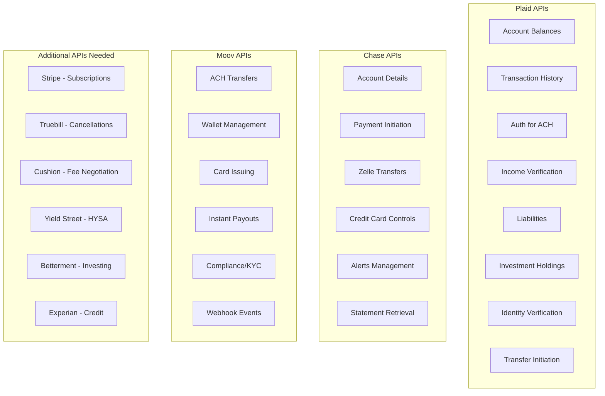
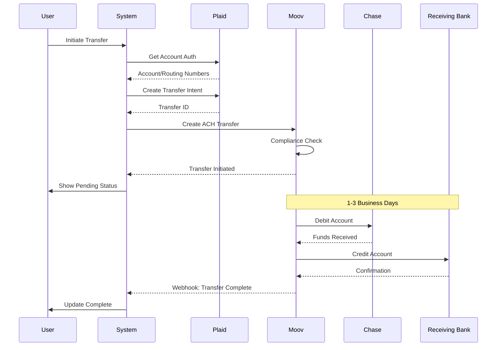
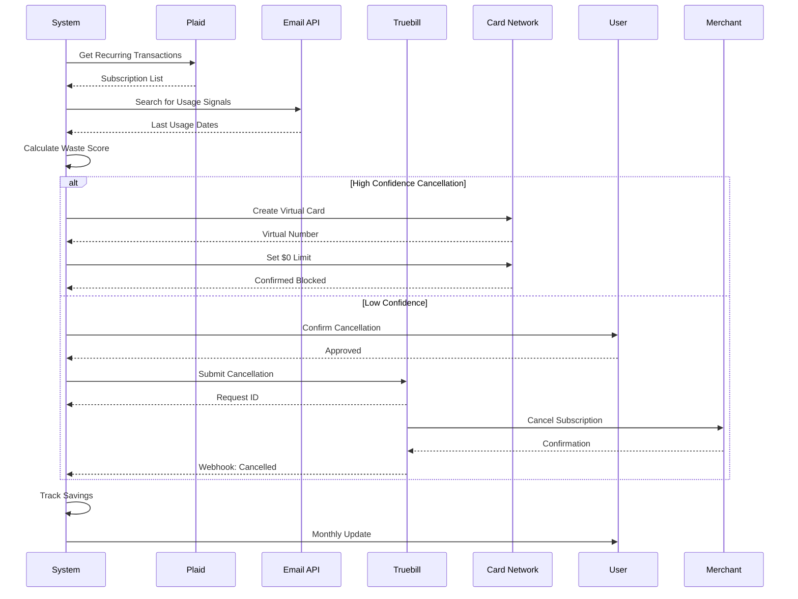

# Executable One-Click Workflow Definitions

## Table of Contents
1. [API Capabilities Matrix](#api-capabilities-matrix)
2. [Workflow Registry](#workflow-registry)
3. [Executable Workflow Definitions](#executable-workflow-definitions)
4. [API Chain Implementations](#api-chain-implementations)
5. [Domain & Webhook Requirements](#domain--webhook-requirements)

---

## API Capabilities Matrix

### What We Can Actually Do



### Realistic Automation Capabilities

| Action Type | What's Possible | What's Not | Workaround |
|------------|-----------------|------------|------------|
| **Move Money** | Transfer between linked accounts, Schedule recurring transfers | Transfer to external unverified accounts | Pre-verify common payees |
| **Cancel Subscriptions** | Flag for cancellation, Block card transactions | Direct vendor cancellation | Virtual card numbers |
| **Negotiate Bills** | Submit negotiation requests, Track outcomes | Real-time negotiation | Partner APIs (Cushion) |
| **Optimize Accounts** | Open new accounts, Move direct deposits | Close existing accounts | Guide manual steps |
| **Invest** | Rebalance portfolios, Tax loss harvest | Pick individual stocks | Use model portfolios |
| **Credit Actions** | Freeze/unfreeze, Set alerts | Dispute items | Document generation |

---

## Workflow Registry

### Workflow ID Structure
```
{category}.{action}.{version}
Example: optimize.cancel_subscriptions.v1
```

### Master Workflow List

```typescript
enum WorkflowCategory {
  OPTIMIZE = 'optimize',      // Cost reduction
  PROTECT = 'protect',        // Risk mitigation  
  GROW = 'grow',             // Wealth building
  EMERGENCY = 'emergency',    // Crisis response
  AUTOMATE = 'automate'      // Recurring actions
}

interface WorkflowRegistry {
  // Optimization Workflows
  'optimize.cancel_subscriptions.v1': CancelUnusedSubscriptions,
  'optimize.negotiate_bills.v1': NegotiateBillsWorkflow,
  'optimize.high_yield_sweep.v1': MoveToHighYieldWorkflow,
  'optimize.consolidate_cash.v1': ConsolidateCashWorkflow,
  'optimize.refinance_check.v1': RefinanceAnalysisWorkflow,
  
  // Protection Workflows  
  'protect.emergency_fund.v1': BuildEmergencyFundWorkflow,
  'protect.freeze_cards.v1': FreezeUnusedCardsWorkflow,
  'protect.insurance_audit.v1': InsuranceGapAnalysisWorkflow,
  'protect.fraud_alerts.v1': SetupFraudAlertsWorkflow,
  'protect.backup_documents.v1': DocumentBackupWorkflow,
  
  // Growth Workflows
  'grow.max_401k.v1': Maximize401kWorkflow,
  'grow.tax_harvest.v1': TaxLossHarvestWorkflow,
  'grow.side_income.v1': SetupSideIncomeWorkflow,
  'grow.invest_windfall.v1': InvestWindfallWorkflow,
  'grow.debt_avalanche.v1': DebtAvalancheWorkflow,
  
  // Emergency Workflows
  'emergency.stop_bleeding.v1': StopFinancialBleedingWorkflow,
  'emergency.negotiate_payment_plans.v1': NegotiatePaymentPlansWorkflow,
  'emergency.liquidate_assets.v1': SmartLiquidationWorkflow,
  'emergency.benefits_enrollment.v1': EmergencyBenefitsWorkflow,
  
  // Automation Workflows
  'automate.bill_pay.v1': SetupAutoBillPayWorkflow,
  'automate.savings_ladder.v1': CreateSavingsLadderWorkflow,
  'automate.investment_dca.v1': DollarCostAveragingWorkflow,
  'automate.round_ups.v1': ActivateRoundUpsWorkflow
}
```

---

## Executable Workflow Definitions

### 1. Cancel Unused Subscriptions Workflow

```typescript
workflow: {
  id: 'optimize.cancel_subscriptions.v1',
  name: 'Cancel Unused Subscriptions',
  
  trigger: {
    simulationResults: ['high_subscription_waste', 'low_emergency_fund'],
    userContext: {
      monthlySubscriptions: '>$200',
      unusedSubscriptions: '>3'
    }
  },
  
  steps: [
    {
      id: 'fetch_recurring',
      name: 'Identify All Subscriptions',
      apis: [
        {
          service: 'plaid',
          endpoint: '/transactions/recurring/get',
          params: {
            account_ids: '${user.linked_accounts}',
            options: {
              include_personal_finance_category: true
            }
          }
        }
      ],
      output: 'recurring_transactions[]'
    },
    
    {
      id: 'analyze_usage',
      name: 'Detect Unused Services',
      apis: [
        {
          service: 'internal',
          endpoint: '/ml/subscription_usage',
          params: {
            subscriptions: '${recurring_transactions}',
            email_access_token: '${user.gmail_token}',
            app_usage_data: '${user.screen_time}'
          }
        }
      ],
      output: 'unused_subscriptions[]'
    },
    
    {
      id: 'virtual_card_block',
      name: 'Block via Virtual Cards',
      condition: 'user.has_virtual_cards',
      apis: [
        {
          service: 'chase',
          endpoint: '/cards/virtual/create',
          params: {
            funding_account: '${user.checking_id}',
            spending_limits: {
              per_transaction: 0,
              monthly: 0
            },
            merchant_controls: {
              blocked_merchants: '${unused_subscriptions.merchant_ids}'
            }
          }
        }
      ],
      output: 'blocked_merchants[]'
    },
    
    {
      id: 'cushion_negotiate',
      name: 'Submit to Cancellation Service',
      condition: '!user.has_virtual_cards',
      apis: [
        {
          service: 'truebill',
          endpoint: '/cancellations/submit',
          params: {
            subscriptions: '${unused_subscriptions}',
            user_authorization: '${user.truebill_token}'
          }
        }
      ],
      output: 'cancellation_requests[]'
    },
    
    {
      id: 'track_savings',
      name: 'Monitor Savings',
      apis: [
        {
          service: 'internal',
          endpoint: '/savings/track',
          params: {
            baseline_spend: '${user.monthly_subscriptions}',
            cancelled_amounts: '${unused_subscriptions.amounts}',
            tracking_period: '3_months'
          }
        }
      ],
      output: 'projected_savings'
    }
  ],
  
  rollback: [
    {
      trigger: 'user_request',
      action: 'unblock_merchant',
      apis: [
        {
          service: 'chase',
          endpoint: '/cards/virtual/update',
          params: {
            card_id: '${virtual_card_id}',
            merchant_controls: {
              blocked_merchants: []
            }
          }
        }
      ]
    }
  ]
}
```

### 2. High-Yield Sweep Workflow

```typescript
workflow: {
  id: 'optimize.high_yield_sweep.v1',
  name: 'Move Cash to High-Yield Savings',
  
  trigger: {
    simulationResults: ['excess_checking_balance', 'low_savings_yield'],
    userContext: {
      checkingBalance: '>$10000',
      savingsAPY: '<1%'
    }
  },
  
  steps: [
    {
      id: 'analyze_cash_flow',
      name: 'Calculate Safe Transfer Amount',
      apis: [
        {
          service: 'plaid',
          endpoint: '/accounts/balance/get',
          params: { account_ids: '${user.checking_accounts}' }
        },
        {
          service: 'plaid',
          endpoint: '/transactions/get',
          params: {
            account_ids: '${user.checking_accounts}',
            start_date: '${90_days_ago}',
            end_date: '${today}'
          }
        }
      ],
      process: 'calculate_minimum_balance_needed',
      output: 'safe_transfer_amount'
    },
    
    {
      id: 'open_hysa',
      name: 'Open High-Yield Account',
      condition: '!user.has_high_yield_savings',
      apis: [
        {
          service: 'yieldstreet',
          endpoint: '/accounts/create',
          params: {
            user_identity: '${user.plaid_identity}',
            initial_deposit: '${safe_transfer_amount}',
            account_type: 'high_yield_savings'
          }
        }
      ],
      webhooks: ['account_opened', 'kyc_complete'],
      output: 'new_account_details'
    },
    
    {
      id: 'initiate_transfer',
      name: 'Transfer Excess Cash',
      apis: [
        {
          service: 'plaid',
          endpoint: '/transfer/create',
          params: {
            access_token: '${user.plaid_token}',
            account_id: '${user.checking_id}',
            type: 'debit',
            amount: '${safe_transfer_amount}',
            description: 'High-yield savings sweep'
          }
        },
        {
          service: 'moov',
          endpoint: '/transfers',
          params: {
            source: '${plaid_transfer_id}',
            destination: '${new_account_details.account_id}',
            amount: '${safe_transfer_amount}',
            description: 'HYSA optimization'
          }
        }
      ],
      output: 'transfer_confirmation'
    },
    
    {
      id: 'setup_auto_sweep',
      name: 'Create Recurring Sweep',
      apis: [
        {
          service: 'moov',
          endpoint: '/recurring-transfers',
          params: {
            source_account: '${user.checking_id}',
            destination_account: '${hysa_account_id}',
            frequency: 'weekly',
            amount_type: 'excess_over',
            threshold: '${calculated_minimum_balance}',
            start_date: '${next_friday}'
          }
        }
      ],
      output: 'recurring_transfer_id'
    }
  ]
}
```

### 3. Emergency Stop Bleeding Workflow

```typescript
workflow: {
  id: 'emergency.stop_bleeding.v1',
  name: 'Stop Financial Bleeding',
  
  trigger: {
    simulationResults: ['negative_cash_flow', 'imminent_overdraft'],
    userContext: {
      daysUntilNegative: '<7',
      monthlyShortfall: '>$500'
    }
  },
  
  steps: [
    {
      id: 'freeze_discretionary',
      name: 'Freeze All Non-Essential Spending',
      parallel: true,
      apis: [
        {
          service: 'chase',
          endpoint: '/cards/controls/categories',
          params: {
            card_ids: '${user.credit_cards}',
            blocked_categories: [
              'entertainment', 'dining', 'shopping',
              'travel', 'recreation'
            ],
            effective_immediately: true
          }
        },
        {
          service: 'plaid',
          endpoint: '/transactions/recurring/get',
          params: {
            account_ids: '${user.all_accounts}',
            options: {
              include_personal_finance_category: true,
              categories: ['subscription', 'membership']
            }
          }
        }
      ],
      output: 'blocked_categories'
    },
    
    {
      id: 'negotiate_immediate',
      name: 'Emergency Bill Negotiations',
      parallel: true,
      apis: [
        {
          service: 'cushion',
          endpoint: '/negotiations/emergency',
          params: {
            bills: '${upcoming_bills_7_days}',
            negotiation_type: 'payment_extension',
            urgency: 'immediate'
          }
        }
      ],
      output: 'negotiation_results'
    },
    
    {
      id: 'liquidate_positions',
      name: 'Smart Asset Liquidation',
      condition: 'projected_shortfall > 1000',
      apis: [
        {
          service: 'betterment',
          endpoint: '/tax-loss-harvesting/emergency',
          params: {
            amount_needed: '${projected_shortfall}',
            tax_optimization: true,
            asset_preference: ['losses_first', 'short_term', 'long_term']
          }
        }
      ],
      manual_fallback: {
        instructions: 'Login to investment accounts and sell positions with losses first',
        tracking_method: 'screenshot_upload'
      },
      output: 'liquidation_proceeds'
    },
    
    {
      id: 'setup_minimum_payments',
      name: 'Switch to Minimums',
      apis: [
        {
          service: 'internal',
          endpoint: '/payments/adjust_all',
          params: {
            payment_accounts: '${user.debt_accounts}',
            new_amount: 'minimum_required',
            effective_date: '${next_payment_date}'
          }
        }
      ],
      output: 'monthly_savings_achieved'
    }
  ]
}
```

### 4. Tax Loss Harvesting Workflow

```typescript
workflow: {
  id: 'grow.tax_harvest.v1',
  name: 'Automated Tax Loss Harvesting',
  
  trigger: {
    simulationResults: ['unrealized_losses', 'high_tax_bracket'],
    marketConditions: {
      volatility: '>20',
      userLosses: '>$1000'
    }
  },
  
  steps: [
    {
      id: 'identify_losses',
      name: 'Scan for Harvest Opportunities',
      apis: [
        {
          service: 'plaid',
          endpoint: '/investments/holdings/get',
          params: {
            account_ids: '${user.taxable_investment_accounts}',
            options: {
              include_cost_basis: true,
              include_securities: true
            }
          }
        }
      ],
      process: 'calculate_unrealized_gains_losses',
      output: 'harvest_candidates[]'
    },
    
    {
      id: 'wash_sale_check',
      name: 'Verify Wash Sale Rules',
      apis: [
        {
          service: 'internal',
          endpoint: '/tax/wash_sale_check',
          params: {
            proposed_sales: '${harvest_candidates}',
            transaction_history: '${user.investment_transactions_60d}',
            related_accounts: '${user.all_investment_accounts}'
          }
        }
      ],
      output: 'safe_to_harvest[]'
    },
    
    {
      id: 'execute_trades',
      name: 'Execute Harvest Trades',
      apis: [
        {
          service: 'alpaca',
          endpoint: '/orders',
          method: 'POST',
          foreach: 'safe_to_harvest',
          params: {
            symbol: '${item.symbol}',
            qty: '${item.shares}',
            side: 'sell',
            type: 'market',
            time_in_force: 'day',
            client_order_id: 'tlh_${item.id}'
          }
        }
      ],
      output: 'sell_confirmations[]'
    },
    
    {
      id: 'replacement_buys',
      name: 'Buy Replacement Securities',
      delay: '1_minute',
      apis: [
        {
          service: 'alpaca',
          endpoint: '/orders',
          method: 'POST',
          foreach: 'sell_confirmations',
          params: {
            symbol: '${item.replacement_symbol}',
            notional: '${item.proceeds}',
            side: 'buy',
            type: 'market',
            time_in_force: 'day',
            client_order_id: 'tlh_replace_${item.id}'
          }
        }
      ],
      output: 'replacement_confirmations[]'
    }
  ]
}
```

---

## API Chain Implementations

### Money Movement Chain



### Subscription Cancellation Chain



---

## Domain & Webhook Requirements

### Required Domains

```yaml
Production Domains:
  api:
    primary: api.financeai.app
    webhooks: webhooks.financeai.app
    
  service_specific:
    plaid: plaid-webhook.financeai.app
    moov: moov-webhook.financeai.app
    chase: chase-callback.financeai.app
    stripe: stripe-webhook.financeai.app
    
  oauth_callbacks:
    google: auth.financeai.app/google/callback
    plaid: auth.financeai.app/plaid/callback
    chase: auth.financeai.app/chase/callback

Development Domains:
  api:
    primary: api-dev.financeai.app
    webhooks: webhooks-dev.financeai.app
    ngrok_fallback: *.ngrok.io
```

### Webhook Endpoints

```typescript
// Plaid Webhooks
POST /webhooks/plaid
{
  webhook_type: 'TRANSACTIONS',
  webhook_code: 'RECURRING_TRANSACTIONS_UPDATE',
  item_id: string,
  account_ids: string[],
  recurring_transactions: {
    added: Transaction[],
    removed: Transaction[],
    modified: Transaction[]
  }
}

// Moov Webhooks  
POST /webhooks/moov
{
  eventID: string,
  type: 'transfer.updated',
  data: {
    transferID: string,
    status: 'completed' | 'failed' | 'pending',
    amount: number,
    failureReason?: string
  }
}

// Chase Webhooks
POST /webhooks/chase
{
  eventType: 'TRANSACTION',
  accountId: string,
  transactionId: string,
  amount: number,
  merchantName: string,
  category: string
}
```

### Security Requirements

```yaml
Webhook Security:
  plaid:
    method: JWT verification
    secret: PLAID_WEBHOOK_SECRET
    
  moov:
    method: HMAC-SHA256
    header: X-Moov-Signature
    
  chase:
    method: OAuth2 + IP whitelist
    allowed_ips: [chase_ip_range]
    
  general:
    - All webhooks over HTTPS
    - Request signing required
    - Replay attack prevention (timestamp + nonce)
    - Rate limiting per source
    - Dead letter queue for failures
```

### API Rate Limits & Quotas

```yaml
Service Limits:
  plaid:
    - 100 requests/minute (Development)
    - 1000 requests/minute (Production)
    - 10,000 transactions per request
    
  moov:
    - 300 requests/minute
    - $10,000 daily transfer limit (starter)
    - $100,000 with enhanced KYC
    
  chase:
    - 50 requests/minute per user
    - 1000 requests/day per app
    
  truebill:
    - 10 cancellations/minute
    - 100 cancellations/day
    
Optimization Strategies:
  - Batch operations where possible
  - Implement request queuing
  - Cache responses (1hr for balances, 24hr for transactions)
  - Use webhooks vs polling
  - Exponential backoff on rate limits
```

This comprehensive workflow system provides executable, API-driven automations that can be triggered from simulation results, with real consideration for what's actually possible with current financial APIs.