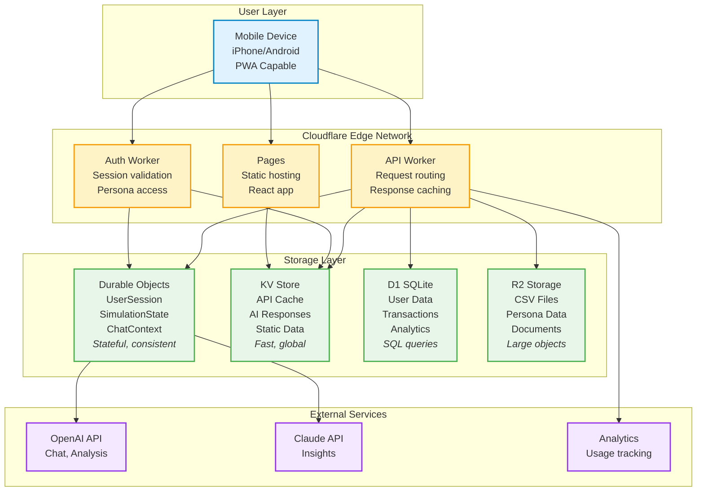
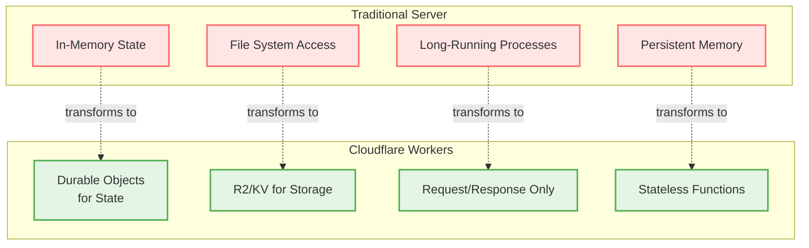
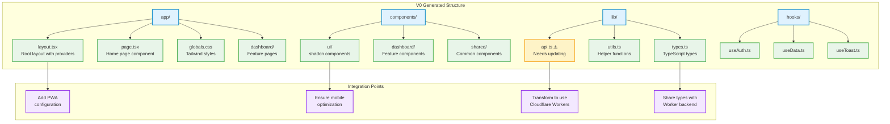
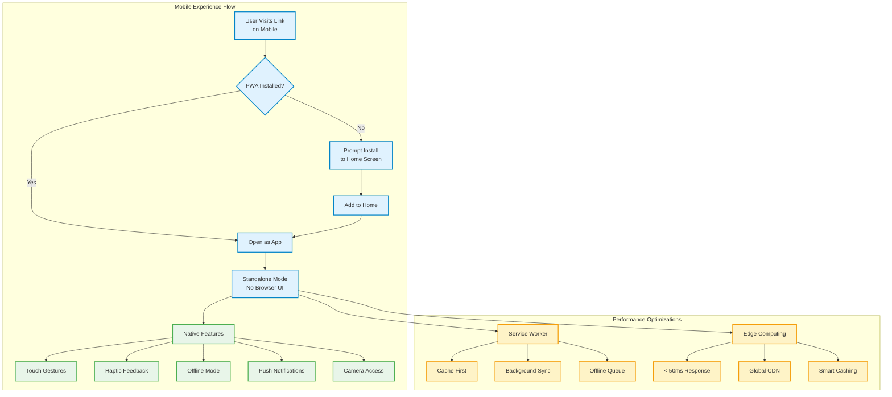
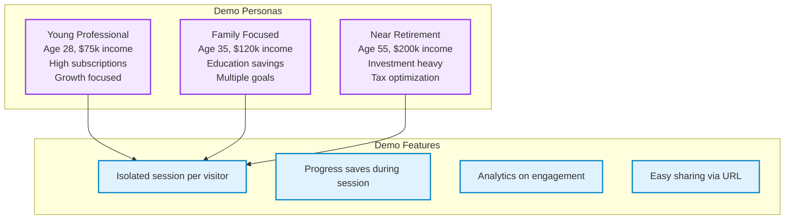
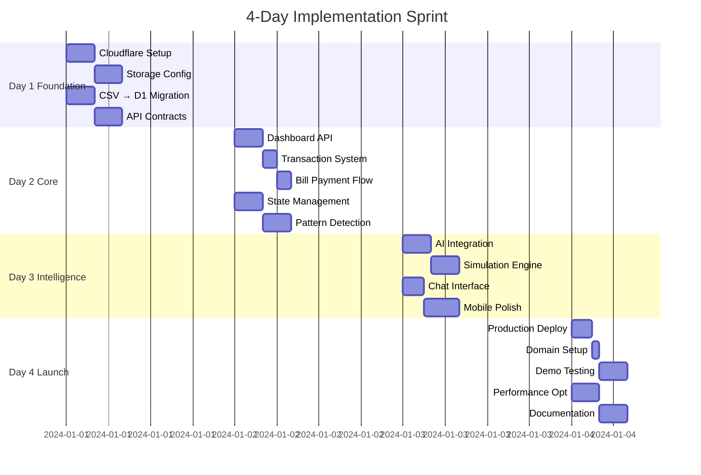
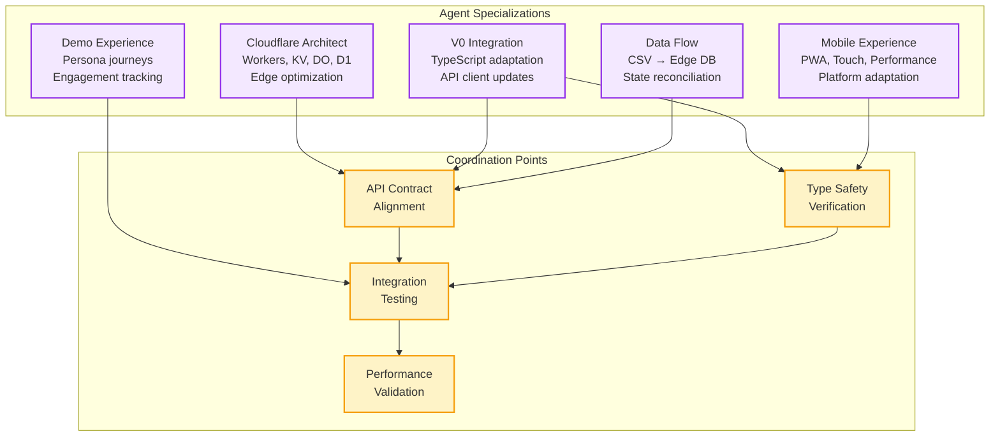
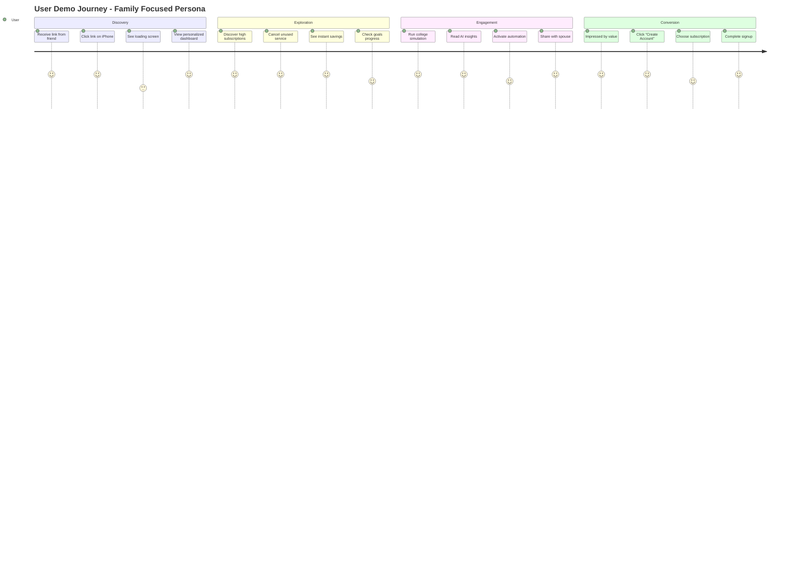

# FinanceAI MVP - Cloudflare Workers Mobile-First Implementation Guide

## Table of Contents
1. [Cloudflare Workers Architecture Strategy](#cloudflare-workers-architecture-strategy)
2. [V0 TypeScript Integration Approach](#v0-typescript-integration-approach)
3. [Mobile-First Experience Philosophy](#mobile-first-experience-philosophy)
4. [Persona Demo System Design](#persona-demo-system-design)
5. [Feature Implementation Strategy](#feature-implementation-strategy)
6. [Testing & Quality Assurance](#testing--quality-assurance)
7. [Agent Task Methodology](#agent-task-methodology)

---

## Cloudflare Workers Architecture Strategy

### Understanding the Cloudflare Ecosystem

### Key Architectural Decisions

**1. Stateless to Stateful Transformation**
Traditional web servers maintain session state in memory between requests. Cloudflare Workers are stateless, requiring a fundamental rethink:
- **Durable Objects** become our stateful session managers
- Each user demo gets its own isolated Durable Object instance
- State mutations are transactional and consistent
- Session data persists across requests without traditional session management

**2. Data Storage Strategy**

```mermaid
flowchart LR
    subgraph "Initial Setup"
        A[CSV Files] -->|Upload| B[R2 Storage]
    end
    
    subgraph "First Access"
        B -->|Parse| C[D1 Database]
        C -->|Structure| D[Tables & Indexes]
    end
    
    subgraph "Runtime Access"
        E[Worker Request] --> F{Cache Hit?}
        F -->|Yes| G[KV Store]
        F -->|No| H[D1 Query]
        H --> I[Process Data]
        I --> J[Update KV]
        I --> K[Return Response]
        G --> K
    end
    
    subgraph "State Management"
        L[User Action] --> M[Durable Object]
        M --> N[Apply Mutation]
        N --> O[Update State]
        O --> P[Persist Changes]
    end
    
    D --> E
    K --> L
    
    classDef storage fill:#E8F5E9,stroke:#4CAF50,stroke-width:2px
    classDef process fill:#FEF3C7,stroke:#F59E0B,stroke-width:2px
    classDef state fill:#E0F2FE,stroke:#0284C7,stroke-width:2px
    
    class A,B,C,D storage
    class E,F,G,H,I,J,K process
    class L,M,N,O,P state
```

The CSV files need special handling in the Workers environment:
- **Initial Load**: CSV files stored in R2 (object storage)
- **Processing**: On first access, parse CSVs and populate D1 database
- **Runtime Access**: Query D1 for structured data access
- **Caching**: Use KV for frequently accessed aggregations
- **Mutations**: Track in Durable Objects, never modify base data

**3. Edge-First Performance**
Cloudflare's global network enables unique optimizations:
- **Geographic Distribution**: Code runs closest to users automatically
- **Intelligent Caching**: Cache API responses at edge locations
- **Minimal Latency**: Sub-50ms response times globally
- **Smart Routing**: Direct database queries to nearest replica

---

## V0 TypeScript Integration Approach

### Understanding V0's Output Structure

V0 generates modern Next.js applications with specific patterns:

**Component Architecture**
- Heavily componentized with shadcn/ui components
- Server components by default in app directory
- Client components marked with 'use client'
- Tailwind CSS for all styling
- TypeScript throughout with strict types

**API Expectations**
V0 assumes traditional REST APIs with these patterns:
- `/api/*` routes for backend calls
- JSON request/response bodies
- Standard HTTP methods (GET, POST, PUT, DELETE)
- Error responses with status codes
- Loading states during fetch

**State Management**
- React hooks for local state
- Context providers for global state
- No external state management library
- Optimistic updates encouraged
- SWR or TanStack Query for server state

### Integration Strategy

**1. API Client Transformation**
The V0-generated API client needs adaptation for Cloudflare Workers:
- Replace relative `/api/*` URLs with Worker endpoints
- Add session and persona headers to all requests
- Implement proper error boundaries for edge cases
- Add retry logic for network failures
- Support response streaming for AI features

**2. Type Safety Preservation**
V0 generates comprehensive TypeScript types that must be honored:
- Share type definitions between frontend and Workers
- Use Zod or similar for runtime validation
- Generate types from OpenAPI schemas
- Ensure response shapes match exactly
- Handle null/undefined cases explicitly

**3. Environment Configuration**
V0 apps use environment variables that need Cloudflare-specific handling:
- `NEXT_PUBLIC_WORKER_URL` for API endpoint
- `NEXT_PUBLIC_ENVIRONMENT` for dev/staging/prod
- Feature flags through KV store
- A/B testing configuration
- Analytics keys

---

## Mobile-First Experience Philosophy

### Core Mobile Principles

**1. Touch-First Interactions**
Every interaction designed for fingers, not cursors:
- Minimum touch targets of 44x44 pixels
- Swipe gestures for navigation
- Pull-to-refresh on scrollable content
- Long press for contextual actions
- Haptic feedback for important actions

**2. Performance Obsession**
Mobile networks are unpredictable, so we optimize aggressively:
- Initial load under 3 seconds on 3G
- Aggressive code splitting by route
- Image lazy loading with placeholders
- Service worker for offline capability
- Minimal JavaScript execution

**3. Native App Feel**
Despite being a web app, it should feel native:
- No browser chrome (PWA standalone mode)
- Native-like transitions and animations
- Platform-specific UI adaptations
- Access to device capabilities
- Smooth 60fps scrolling

### Cloudflare Mobile Optimizations

**1. Adaptive Responses**
Workers detect device type and optimize accordingly:
- Smaller payloads for mobile devices
- Different image resolutions based on screen
- Simplified data structures for mobile
- Prioritized content loading
- Mobile-specific caching strategies

**2. Progressive Enhancement**
Start basic, enhance based on capabilities:
- Core functionality works on any device
- Enhanced features for modern browsers
- Graceful degradation for older devices
- Feature detection, not user agent sniffing
- Offline-first architecture

**3. Edge-Side Rendering**
Leverage Workers for mobile-specific optimizations:
- HTML minification at edge
- Critical CSS inlining
- Resource prioritization
- Compression optimization
- Geographic CDN benefits

---

## Persona Demo System Design

### Shareable Demo Architecture

```mermaid
graph LR
    subgraph "Share Phase"
        A[Shareable Link<br/>financeai.app/demo/family]
    end
    
    subgraph "Worker Processing"
        B[Parse persona slug]
        C[Create session ID]
        D[Initialize Durable Object]
        E[Load persona data]
        F[Set demo mode]
        G[Track referrer]
        H[Redirect to app]
        
        B --> C
        C --> D
        D --> E
        E --> F
        F --> G
        G --> H
    end
    
    subgraph "App Launch"
        I[Dashboard loaded]
        J[Persona data ready]
        K[Demo banner shown]
        L[Guided tour available]
        M[Actions tracked]
        N[Reset available]
        
        I --> J
        J --> K
        K --> L
        L --> M
        M --> N
    end
    
    A --> B
    H --> I
    
    classDef shareLink fill:#E0F2FE,stroke:#0284C7,stroke-width:2px
    classDef processing fill:#FEF3C7,stroke:#F59E0B,stroke-width:2px
    classDef appLaunch fill:#E8F5E9,stroke:#4CAF50,stroke-width:2px
    
    class A shareLink
    class B,C,D,E,F,G,H processing
    class I,J,K,L,M,N appLaunch
```

#### Available Personas

### Persona System Design

**1. URL-Based Persona Selection**
Clean URLs that are easy to share and remember:
- `/demo/young-professional` - Tech worker with subscription overload
- `/demo/family-focused` - Parent balancing multiple financial goals
- `/demo/near-retirement` - Professional planning exit strategy

**2. Session Isolation**
Each demo visitor gets a completely isolated experience:
- Unique session ID generated on first visit
- Durable Object instance per session
- No data bleeds between sessions
- Sessions expire after 24 hours
- Option to reset and start fresh

**3. Demo Mode Indicators**
Clear visual cues that this is a demo:
- Subtle banner indicating demo mode
- "Assuming persona of..." message
- Quick switch between personas
- Reset button always visible
- Demo limitations explained

**4. Engagement Tracking**
Analytics to understand demo effectiveness:
- Which persona is most popular
- Common user paths through demo
- Features that get most interaction
- Where users drop off
- Conversion to sign-up tracking

---

## Feature Implementation Strategy

### Dashboard Implementation

**Data Aggregation Strategy**
The dashboard requires multiple data points assembled efficiently:
- Net worth calculation from all accounts
- Recent transaction list with categories
- Spending breakdown visualization
- Goal progress indicators
- AI-generated insights

**Edge Optimization Approach**
- Pre-calculate common aggregations in Durable Objects
- Cache dashboard response in KV with 5-minute TTL
- Parallel fetch all widget data
- Progressive loading of less critical widgets
- Stale-while-revalidate for better perceived performance

### Transaction Management

**Pattern Detection at the Edge**
Workers can efficiently process transaction patterns:
- Group transactions by merchant in Durable Object
- Calculate recurring patterns during quiet periods
- Store detected patterns in D1 for querying
- Surface insights through AI analysis
- Real-time updates as new transactions arrive

**Search Implementation**
Full-text search without traditional infrastructure:
- Use D1's SQLite FTS5 (full-text search)
- Index transaction descriptions and merchants
- Cache popular search queries in KV
- Implement search suggestions from common queries
- Paginate results for mobile performance

### Bill Payment System

**Workflow Orchestration**
Bill payment touches multiple systems:
- Verify bill details from transaction history
- Check account balance including pending
- Process payment atomically in Durable Object
- Update all affected states immediately
- Generate confirmation and audit trail
- Trigger related updates (goals, insights)

**Mobile Optimization**
- One-thumb operation for entire flow
- Clear visual feedback at each step
- Haptic feedback on confirmation
- Undo capability within 60 seconds
- Quick pay for recurring bills

### Subscription Management

**Detection and Analysis**
Subscription identification leveraging edge computing:
- Pattern matching on transaction data
- Grouping by merchant and frequency
- Cost aggregation across billing cycles
- Usage inference from transaction patterns
- Savings calculation from cancellations

**Cancellation Flow**
Mobile-optimized cancellation assistance:
- One-tap cancellation tracking
- Visual savings counter
- Reminder notifications
- Alternative service suggestions
- Achievement celebration on savings

### Goal Management

**Progress Calculation**
Real-time goal tracking at the edge:
- Current progress from account balances
- Projection based on contribution patterns
- Milestone detection and celebration
- Multi-goal optimization suggestions
- Visual progress indicators

**Mobile Experience**
- Swipeable goal cards
- Pull-to-refresh progress
- Celebratory animations on milestones
- Easy contribution adjustments
- Social sharing of achievements

### Financial Simulations

**Edge Computation Strategy**
Simulations are computationally intensive but manageable:
- Pre-compute common scenarios during quiet times
- Cache results aggressively in KV
- Use Durable Objects for stateful calculations
- Stream results as they're calculated
- Progressive enhancement of details

**Result Presentation**
Mobile-first visualization of complex data:
- Story-based result presentation
- Swipeable insight cards
- Interactive timeline visualization
- One-tap automation activation
- Shareable result summaries

### AI Integration

**Service Architecture**
AI calls from Workers with smart caching:
- Direct API calls to OpenAI/Claude
- Response caching in KV by prompt hash
- Streaming responses for better UX
- Fallback to cached responses on failure
- Token usage tracking per session

**Context Management**
Efficient context building at the edge:
- Summarize user data in Durable Object
- Include relevant recent actions
- Maintain conversation history
- Privacy-preserving prompts
- Minimal token usage optimization

### Automation Framework

**Execution at the Edge**
Automations run reliably on Workers:
- Scheduled automations via Cron Triggers
- State machines in Durable Objects
- Atomic execution with rollback
- Comprehensive audit logging
- Failure notifications

**Safety Mechanisms**
Protecting users from automation errors:
- Dry run mode for testing
- Balance minimums enforced
- Unusual activity detection
- Manual approval for large amounts
- Emergency stop functionality

---

## Testing & Quality Assurance

### Testing Strategy for Cloudflare Workers

**Local Development Testing**
Miniflare enables local Worker development:
- Full Workers API compatibility
- Local KV, D1, and Durable Objects
- Realistic latency simulation
- Multi-worker testing
- Integration test scenarios

**Edge Testing Approach**
- Deploy to Workers preview environments
- Test from multiple geographic locations
- Verify cache behavior
- Load test with realistic traffic
- Monitor performance metrics

**Mobile-Specific Testing**
- Real device testing on various networks
- PWA installation and update testing
- Offline functionality verification
- Touch gesture responsiveness
- Performance on low-end devices

### Quality Assurance Process

**Persona Journey Validation**
Each persona must have flawless demo paths:
1. Initial load and persona assumption
2. Key feature demonstration
3. Wow moment delivery
4. Smooth transitions
5. Error recovery

**Cross-Platform Verification**
- iOS Safari (critical for iPhone)
- Chrome on Android
- PWA on both platforms
- Desktop responsive view
- Tablet adaptations

**Performance Benchmarks**
- Time to Interactive < 3 seconds
- Lighthouse score > 90
- No layout shifts
- 60fps scrolling
- Minimal battery impact

---

## Agent Task Methodology

### Agent Organization Strategy

**Specialized Agent Roles**
Each agent has deep expertise in their domain:

1. **Cloudflare Architect Agent**
   - Expert in Workers, KV, Durable Objects, D1
   - Designs distributed state management
   - Optimizes for edge performance
   - Handles storage strategy

2. **V0 Integration Agent**
   - Understands V0 code generation patterns
   - Adapts TypeScript components
   - Maintains type safety
   - Preserves V0's clean architecture

3. **Mobile Experience Agent**
   - Touch interaction expert
   - Performance optimization specialist
   - PWA implementation
   - Platform-specific adaptations

4. **Data Flow Agent**
   - CSV to edge database migration
   - State reconciliation logic
   - Caching strategies
   - Data consistency maintenance

5. **Demo Experience Agent**
   - Persona journey design
   - Engagement optimization
   - Analytics implementation
   - Conversion tracking

### Implementation Phases

**Phase 1: Foundation (Day 1)**
Morning Focus: Architecture Setup
- Cloudflare Worker project initialization
- Storage layer configuration (KV, D1, R2)
- Durable Object classes design
- V0 frontend integration planning

Afternoon Focus: Data Layer
- CSV to D1 migration strategy
- Base data loading system
- Session state management design
- API contract definition

**Phase 2: Core Features (Day 2)**
Morning Focus: Essential Flows
- Dashboard data aggregation
- Transaction management system
- Bill payment workflow
- State mutation handling

Afternoon Focus: Intelligence Layer
- Pattern detection implementation
- Subscription identification
- Goal progress tracking
- Basic automation framework

**Phase 3: Advanced Features (Day 3)**
Morning Focus: AI & Simulations
- AI service integration
- Simulation engine on edge
- Chat interface implementation
- Insight generation system

Afternoon Focus: Mobile Polish
- Touch interactions refinement
- Performance optimization
- PWA manifest configuration
- Offline capability

**Phase 4: Demo Excellence (Day 4)**
Morning Focus: Deployment
- Production environment setup
- Domain configuration
- SSL and security
- Monitoring setup

Afternoon Focus: Demo Preparation
- Persona journey testing
- Performance verification
- Analytics integration
- Documentation completion

### Success Criteria

**Technical Excellence**
- All features work on mobile devices
- Sub-3 second load times globally
- No errors in demo paths
- Smooth animations at 60fps
- Offline capability functional

**Demo Effectiveness**
- Clear value proposition in 30 seconds
- Three wow moments per persona
- Seamless sharing experience
- High engagement metrics
- Path to conversion clear

**Code Quality**
- Type safety throughout
- Comprehensive error handling
- Clear documentation
- Modular architecture
- Easy to extend

This implementation guide provides a complete blueprint for building FinanceAI on Cloudflare Workers with a mobile-first approach, ensuring the demo system delivers an impressive experience that converts visitors into users.