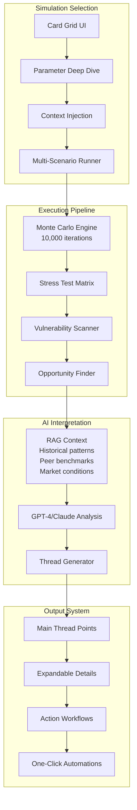
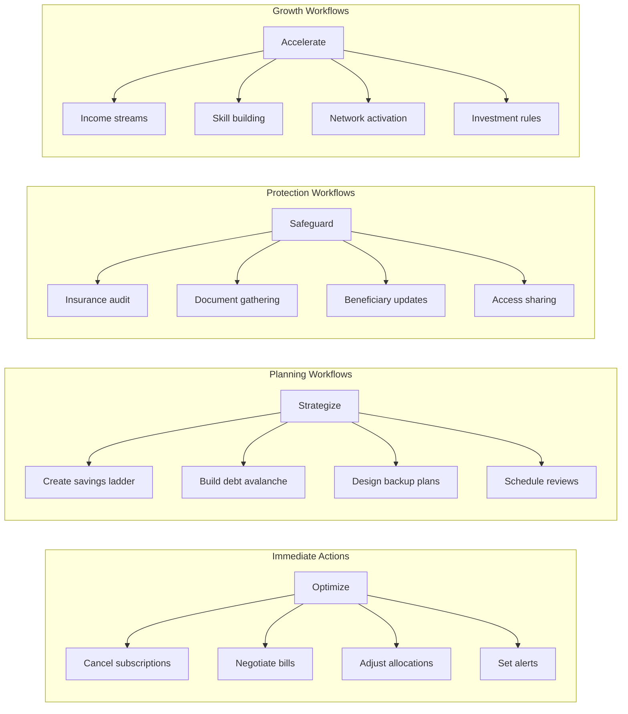

# Future Casting Simulation Engine Design

## Table of Contents
1. [Core Architecture](#core-architecture)
2. [Simulation Catalog](#simulation-catalog)
3. [Decision Axes & Tunability](#decision-axes--tunability)
4. [Twitter Thread Output Format](#twitter-thread-output-format)
5. [Workflow Automation System](#workflow-automation-system)

---

## Core Architecture

### System Overview



### Example Implementation (Emergency Fund Runway)

```javascript
class EmergencyFundRunwaySimulation {
  // This is the ONLY code example - showing the depth we need
  
  parameters = {
    // Income Volatility Factors
    jobStabilityScore: { min: 0, max: 100, default: 75 },
    industryVolatility: { options: ['tech', 'healthcare', 'retail', 'finance'] },
    incomeStreams: { min: 1, max: 5 },
    contractVsW2: { percentage: true },
    
    // Expense Variability
    fixedExpenseRatio: { min: 0.3, max: 0.9 },
    discretionaryBuffer: { percentage: true },
    dependentCount: { min: 0, max: 10 },
    specialNeeds: { multiplier: 1.0 - 3.0 },
    
    // Geographic Factors
    costOfLivingIndex: { based_on: 'zipcode' },
    disasterRiskScore: { hurricane: 0-10, earthquake: 0-10, flood: 0-10 },
    localUnemploymentRate: { real_time: true },
    
    // Health & Insurance
    healthConditions: { chronic: boolean, acute_risk: 0-100 },
    insuranceQuality: { scale: 'catastrophic' to 'platinum' },
    deductibleVsOOP: { current_year_spent: amount },
    
    // Time Horizons
    runwayTargetMonths: { min: 3, max: 24 },
    careerStageMultiplier: { entry: 1.5, mid: 1.0, senior: 0.8 },
    retirementProximity: { years: number }
  };
  
  async execute() {
    // 10,000 Monte Carlo iterations considering:
    // - Job loss probability curves
    // - Emergency timing distributions
    // - Expense spike patterns
    // - Recovery time modeling
    // - Cascade effect analysis
  }
}
```

---

## Simulation Catalog

### 1. Emergency Fund Runway
**Purpose**: Calculate how long your money lasts under various stress scenarios

**Complexity Axes**:
- Income interruption patterns (sudden vs gradual)
- Expense surge modeling (medical, family emergency, legal)
- Asset liquidity timeline (can't sell house immediately)
- Credit availability degradation
- Support network financial capacity
- Geographic cost variations
- Industry-specific unemployment duration
- Benefits cliff effects
- COBRA costs timeline
- State unemployment insurance variations

### 2. Student Loan Payoff Strategies
**Purpose**: Optimize repayment under life changes and policy shifts

**Complexity Axes**:
- Federal vs private loan mix
- Income-driven repayment recertification
- Marriage penalty calculations
- PSLF employment continuity risk
- Refinancing opportunity windows
- Tax bomb planning for forgiveness
- Career trajectory modeling
- Side income stability
- Family planning timeline impacts
- State tax treatment variations
- Interest rate environment projections
- Legislative change probability

### 3. Medical Bill Crisis
**Purpose**: Model catastrophic health expense impacts

**Complexity Axes**:
- Insurance plan actuarial value
- Network adequacy surprises
- Balance billing exposure
- Chronic vs acute cost patterns
- Prescription drug formulary changes
- Out-of-pocket maximum timing
- Income-based assistance eligibility
- Medical debt negotiation success rates
- Credit score impact trajectories
- Bankruptcy threshold analysis
- FSA/HSA optimization strategies
- Disability insurance gaps

### 4. City Income Volatility
**Purpose**: Analyze gig economy and variable income resilience

**Complexity Axes**:
- Platform algorithm changes
- Seasonal demand patterns
- Multi-app optimization
- Expense timing flexibility
- Tax withholding shortfalls
- Benefits replacement costs
- Income smoothing strategies
- Geographic arbitrage opportunities
- Skill obsolescence risk
- Platform deactivation risk
- Customer rating vulnerabilities
- Equipment depreciation

### 5. Market Crash Scenarios
**Purpose**: Test portfolio resilience across asset classes

**Complexity Axes**:
- Correlation breakdown modeling
- Liquidity cascade effects
- Margin call sequences
- Tax loss harvesting opportunities
- Rebalancing triggers
- Behavioral bias coefficients
- Income replacement needs
- Real estate exposure
- Cryptocurrency volatility
- International exposure
- Dollar strength impacts
- Recovery timeline distributions

### 6. First Home Expenses
**Purpose**: True cost modeling beyond mortgage

**Complexity Axes**:
- Hidden closing costs
- Immediate repair needs
- Property tax reassessment risk
- HOA special assessments
- Insurance premium shocks
- Utility setup costs
- Maintenance reserve requirements
- Appliance failure timing
- Landscaping requirements
- Permit and compliance costs
- Neighborhood trajectory
- Climate risk pricing

### 7. Job Loss Hazard
**Purpose**: Comprehensive unemployment impact modeling

**Complexity Axes**:
- Industry automation risk
- Skill transferability scores
- Network strength metrics
- Severance probability
- Non-compete limitations
- Benefits continuation costs
- Retirement account penalties
- Stock option forfeitures
- Reputation risk factors
- Age discrimination probability
- Geographic mobility constraints
- Retraining requirements

### 8. Climate Disaster Exposure
**Purpose**: Physical and financial climate risk assessment

**Complexity Axes**:
- Property damage probability
- Insurance gap analysis
- Evacuation cost modeling
- Income interruption duration
- FEMA assistance delays
- Contractor availability
- Building code changes
- Property value impacts
- Infrastructure recovery time
- Supply chain disruptions
- Community support variance
- Migration cost analysis

### 9. Rent Hike Stress Test
**Purpose**: Housing affordability shock modeling

**Complexity Axes**:
- Local rent control laws
- Lease renewal timing
- Moving cost totals
- Security deposit locks
- School district impacts
- Commute cost changes
- Storage requirements
- Pet restriction costs
- Roommate reliability
- Sublet restrictions
- Eviction risk modeling
- Legal assistance needs

### 10. Auto Repair Card Cascade
**Purpose**: Transportation crisis financial modeling

**Complexity Axes**:
- Repair vs replace decision tree
- Credit utilization impacts
- Insurance claim complexity
- Rental/rideshare costs
- Work attendance risks
- Warranty investigations
- Mechanic trust factors
- Used car market timing
- Loan underwater analysis
- Registration/inspection timing
- Alternative transport costs
- Income disruption probability

---

## Decision Axes & Tunability

### Universal Parameters Applied to All Simulations

```yaml
Personal Context:
  Demographics:
    - Age (affects time horizons)
    - Family structure (dependents, elderly care)
    - Health status (chronic conditions, risk factors)
    - Education level (earning potential)
    - Career stage (entry/mid/senior/near-retirement)
  
  Geographic:
    - Cost of living index
    - State tax environment
    - Natural disaster risk
    - Job market depth
    - Family proximity
  
  Financial Behavior:
    - Risk tolerance (measured, not stated)
    - Savings consistency score
    - Debt management history
    - Investment knowledge level
    - Financial support network

Scenario Intensity:
  - Best case (90th percentile)
  - Likely case (50th percentile)  
  - Stress case (10th percentile)
  - Black swan (1st percentile)

Time Horizons:
  - Immediate (0-3 months)
  - Short-term (3-12 months)
  - Medium-term (1-5 years)
  - Long-term (5-30 years)

Correlation Factors:
  - Economic linkages
  - Personal factor correlations
  - Geographic correlations
  - Industry correlations
```

---

## Twitter Thread Output Format

### Thread Structure

```
🧵 [EMOJI] Your [SCENARIO] Reality Check

1/ The headline number: [STARK FINDING]
   You're [X time/dollars] away from [OUTCOME]
   
   [↓ Why this matters]

2/ The hidden factors killing you:
   • [Factor 1]: costs you $X/month
   • [Factor 2]: reduces runway by Y months
   • [Factor 3]: [Specific impact]
   
   [↓ See calculations]

3/ 🚨 Biggest vulnerability:
   [SPECIFIC WEAK POINT]
   This could trigger [CASCADE EFFECT]
   
   [↓ Stress test results]

4/ The good news nobody tells you:
   [UNEXPECTED STRENGTH OR OPPORTUNITY]
   You could leverage this for [BENEFIT]
   
   [↓ How to capitalize]

5/ Your competition/peers:
   • 50% of similar profiles: [WORSE OFF]
   • But top 25% have: [WHAT THEY DO]
   
   [↓ Detailed comparison]

6/ Three moves for immediate impact:
   📌 [Action 1] → saves $X in Y days
   📌 [Action 2] → reduces risk by Z%
   📌 [Action 3] → [Specific outcome]
   
   [↓ Start workflow]

7/ The 6-month transformation:
   If you execute the plan:
   • Month 1-2: [Changes]
   • Month 3-4: [Milestones]
   • Month 6: [New position]
   
   [↓ Full timeline]

8/ The uncomfortable truth:
   [HARD REALITY ABOUT SITUATION]
   But here's what that actually means...
   
   [↓ Deep dive]

9/ Your automatic next steps:
   ✅ [One-click action 1]
   ✅ [One-click action 2]
   ✅ [Calendar integration]
   
   [→ Activate plan]

10/ Remember: [PERSPECTIVE SHIFT]
    Your situation is [CONTEXT], not [FEAR]
    
    Want to run another scenario?
    [Show scenario cards]
```

### Expandable Detail Formats

Each [↓] button expands into:

```
[↓ Why this matters] →
  
  📊 The Math Behind This:
  • Your current [metric]: $X
  • Industry threshold: $Y  
  • Gap analysis: [visual chart]
  • Time to danger zone: [timeline]
  
  📈 Historical Context:
  People in your situation typically...
  [Data-driven insight]
  
  🎯 Priority Level: [CRITICAL/HIGH/MEDIUM]
  Because [specific reason]
```

---

## Workflow Automation System

### One-Click Workflow Types



### Workflow Tracking

Each workflow has:
- Pre-conditions check
- Step-by-step execution
- Progress indicators
- Rollback capabilities
- Success metrics
- Celebration moments
- Next workflow suggestions

### API-Facilitated Actions

The system can automatically:
1. **Financial Moves**: Transfer funds, adjust contributions, set up rules
2. **External Integrations**: Calendar blocks, reminder systems, document requests
3. **Monitoring Setup**: Alerts, thresholds, review schedules
4. **Social Features**: Share sanitized insights, find accountability partners
5. **Learning Paths**: Queue relevant education, track progress

This creates a complete ecosystem where simulation insights immediately translate into executable improvements in the user's financial life.